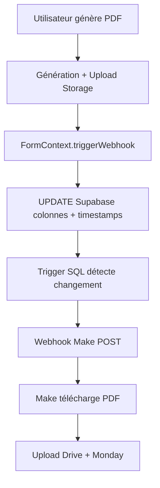

# 📄 PLAN UPLOAD PDF - Architecture Complète
*Mise à jour : 17 novembre 2025*

---

## 🎯 **VUE D'ENSEMBLE**

Système complet de génération et synchronisation PDF pour l'application Fiche Logement, comprenant :
- **2 PDF Fiches** : Logement (complet) + Ménage (filtré)
- **2 PDF Assistants IA** : Guide d'accès + Annonce
- **Synchronisation automatique** vers Google Drive et Monday.com via Make

---

## 🏗️ **ARCHITECTURE GÉNÉRALE**

### **Workflow Frontend → Supabase → Make**



---

## 📊 **1. PDF FICHES LOGEMENT & MÉNAGE**

### **Composants**

#### **PDFUpload.jsx**
- Génère 2 PDF simultanément via iframes cachés
- Routes : `/print-pdf` (logement) + `/print-pdf-menage` (ménage)
- Upload vers bucket `fiche-pdfs`
- Appelle `triggerPdfWebhook(urlLogement, urlMenage)`

#### **Templates**
- **PDFTemplate.jsx** : Fiche complète (23 sections)
- **PDFMenageTemplate.jsx** : Fiche filtrée (14 sections ménage)

#### **Génération**
```javascript
// html2pdf.js avec pagination intelligente
const options = {
  margin: [15, 15, 15, 15],
  image: { type: 'jpeg', quality: 0.95 },
  html2canvas: { scale: 2, useCORS: true },
  jsPDF: { unit: 'mm', format: 'a4', orientation: 'portrait', compress: true },
  pagebreak: { mode: ['avoid-all', 'css'], avoid: ['.section', '.header'] }
}
```

### **Storage Supabase**

```
📁 Bucket "fiche-pdfs" (PUBLIC)
├── 📄 fiche-logement-7755.pdf
├── 📄 fiche-menage-7755.pdf
└── ...

Pattern nommage : fiche-{type}-{numero_bien}.pdf
```

### **Base de données**

```sql
-- Colonnes PDF Fiches
pdf_logement_url TEXT
pdf_menage_url TEXT
pdf_last_generated_at TIMESTAMP WITH TIME ZONE
```

### **Trigger SQL**

```sql
-- Fonction : notify_pdf_update()
-- Trigger : fiche_pdf_update_webhook
-- Condition : pdf_last_generated_at change

CREATE OR REPLACE FUNCTION public.notify_pdf_update()
RETURNS trigger
LANGUAGE plpgsql
AS $function$
BEGIN
  IF OLD.pdf_last_generated_at IS DISTINCT FROM NEW.pdf_last_generated_at THEN
    PERFORM net.http_post(
      url := 'https://hook.eu2.make.com/3vmb2eijfjw8nc5y68j8hp3fbw67az9q',
      body := jsonb_build_object(
        'id', NEW.id,
        'nom', NEW.nom,
        'statut', NEW.statut,
        'updated_at', NEW.updated_at,
        'proprietaire', jsonb_build_object(...),
        'logement', jsonb_build_object(...),
        'pdfs', jsonb_build_object(
          'logement_url', NEW.pdf_logement_url,
          'menage_url', NEW.pdf_menage_url
        ),
        'trigger_type', 'pdf_update'
      ),
      headers := '{"Content-Type": "application/json"}'::jsonb
    );
  END IF;
  RETURN NEW;
END;
$function$;
```

### **FormContext.jsx**

```javascript
const triggerPdfWebhook = async (pdfLogementUrl, pdfMenageUrl) => {
  // UPDATE direct Supabase
  const { data, error } = await supabase
    .from('fiches')
    .update({
      pdf_logement_url: pdfLogementUrl,
      pdf_menage_url: pdfMenageUrl,
      pdf_last_generated_at: new Date().toISOString(),
      updated_at: new Date().toISOString()
    })
    .eq('id', formData.id)
    .select()
  
  // Trigger SQL se déclenche automatiquement
  return { success: true, data: data[0] }
}
```

---

## 🤖 **2. PDF ASSISTANTS IA (GUIDE D'ACCÈS + ANNONCE)**

### **Composants**

#### **generateAssistantPDF.js**
- **generateGuideAccesPDF()** : Génère PDF guide d'accès
- **generateAnnoncePDF()** : Génère PDF annonce
- Upload vers buckets dédiés avec `upsert: true`
- Pattern nommage : `guide_acces_{ficheId}.pdf` / `annonce_{ficheId}.pdf`

#### **FicheGuideAcces.jsx**
```javascript
const handleValidateGuide = async () => {
  // Nettoyer contenu IA
  const cleanedContent = message.content
    .replace(/([^\s]):/g, '$1 :')
    .replace(/\u00A0/g, ' ')
  
  // Générer PDF
  const pdfUrl = await generateGuideAccesPDF(cleanedContent, metadata, formData.id)
  
  // Déclencher webhook
  const result = await triggerAssistantPdfWebhook(pdfUrl, null)
}
```

#### **FicheFinalisation.jsx**
```javascript
const handleValidateAnnonce = async () => {
  // Nettoyer contenu IA
  const cleanedContent = message.content
    .replace(/([^\s]):/g, '$1 :')
    .replace(/\u00A0/g, ' ')
  
  // Générer PDF
  const pdfUrl = await generateAnnoncePDF(cleanedContent, metadata, formData.id)
  
  // Déclencher webhook
  const result = await triggerAssistantPdfWebhook(null, pdfUrl)
}
```

### **Storage Supabase**

```
📁 Bucket "guide-acces-pdfs" (PUBLIC)
├── 📄 guide_acces_6ce4732b-1062-4f43-bc4d-e91aff9f32c9.pdf
└── ...

📁 Bucket "annonce-pdfs" (PUBLIC)
├── 📄 annonce_6ce4732b-1062-4f43-bc4d-e91aff9f32c9.pdf
└── ...
```

### **Base de données**

```sql
-- Colonnes PDF Assistants
guide_acces_pdf_url TEXT
guide_acces_last_generated_at TIMESTAMP WITH TIME ZONE
annonce_pdf_url TEXT
annonce_last_generated_at TIMESTAMP WITH TIME ZONE
```

### **Triggers SQL (2 triggers séparés)**

#### **Trigger Guide d'accès**
```sql
-- Fonction : notify_guide_acces_pdf_update()
-- Trigger : fiche_guide_acces_pdf_webhook
-- Condition : guide_acces_last_generated_at change

CREATE OR REPLACE FUNCTION public.notify_guide_acces_pdf_update()
RETURNS trigger
LANGUAGE plpgsql
AS $function$
BEGIN
  IF OLD.guide_acces_last_generated_at IS DISTINCT FROM NEW.guide_acces_last_generated_at THEN
    PERFORM net.http_post(
      url := 'https://hook.eu2.make.com/wjonl6ikb3fl8sk2tr5k7f95lupo4t6z',
      body := jsonb_build_object(
        'id', NEW.id,
        'nom', NEW.nom,
        'assistant_pdf', jsonb_build_object(
          'url', NEW.guide_acces_pdf_url,
          'type', 'guide_acces',
          'last_generated_at', NEW.guide_acces_last_generated_at
        ),
        'trigger_type', 'assistant_pdf_update',
        'pdf_type', 'guide_acces'
      ),
      headers := '{"Content-Type": "application/json"}'::jsonb
    );
  END IF;
  RETURN NEW;
END;
$function$;
```

#### **Trigger Annonce**
```sql
-- Fonction : notify_annonce_pdf_update()
-- Trigger : fiche_annonce_pdf_webhook
-- Condition : annonce_last_generated_at change

CREATE OR REPLACE FUNCTION public.notify_annonce_pdf_update()
RETURNS trigger
LANGUAGE plpgsql
AS $function$
BEGIN
  IF OLD.annonce_last_generated_at IS DISTINCT FROM NEW.annonce_last_generated_at THEN
    PERFORM net.http_post(
      url := 'https://hook.eu2.make.com/wjonl6ikb3fl8sk2tr5k7f95lupo4t6z',
      body := jsonb_build_object(
        'id', NEW.id,
        'nom', NEW.nom,
        'assistant_pdf', jsonb_build_object(
          'url', NEW.annonce_pdf_url,
          'type', 'annonce',
          'last_generated_at', NEW.annonce_last_generated_at
        ),
        'trigger_type', 'assistant_pdf_update',
        'pdf_type', 'annonce'
      ),
      headers := '{"Content-Type": "application/json"}'::jsonb
    );
  END IF;
  RETURN NEW;
END;
$function$;
```

### **FormContext.jsx**

```javascript
const triggerAssistantPdfWebhook = async (guideAccesUrl, annonceUrl) => {
  const updateData = {}
  
  if (guideAccesUrl) {
    updateData.guide_acces_pdf_url = guideAccesUrl
    updateData.guide_acces_last_generated_at = new Date().toISOString()
  }
  
  if (annonceUrl) {
    updateData.annonce_pdf_url = annonceUrl
    updateData.annonce_last_generated_at = new Date().toISOString()
  }
  
  updateData.updated_at = new Date().toISOString()
  
  const { data, error } = await supabase
    .from('fiches')
    .update(updateData)
    .eq('id', formData.id)
    .select()
  
  // Triggers SQL se déclenchent automatiquement
  return { success: true, data: data[0] }
}
```

---

## 🔧 **MAPPING SUPABASEHELPERS.JS**

### **mapFormDataToSupabase**
```javascript
// PDF Fiches
pdf_logement_url: formData.pdf_logement_url || null,
pdf_menage_url: formData.pdf_menage_url || null,
// pdf_last_generated_at: NE PAS MAPPER (géré par triggerPdfWebhook)

// PDF Assistants
guide_acces_pdf_url: formData.guide_acces_pdf_url || null,
annonce_pdf_url: formData.annonce_pdf_url || null,
// guide_acces_last_generated_at: NE PAS MAPPER (géré par triggerAssistantPdfWebhook)
// annonce_last_generated_at: NE PAS MAPPER (géré par triggerAssistantPdfWebhook)
```

### **mapSupabaseToFormData**
```javascript
// PDF Fiches
pdf_logement_url: supabaseData.pdf_logement_url || null,
pdf_menage_url: supabaseData.pdf_menage_url || null,
pdf_last_generated_at: supabaseData.pdf_last_generated_at,

// PDF Assistants
guide_acces_pdf_url: supabaseData.guide_acces_pdf_url || null,
annonce_pdf_url: supabaseData.annonce_pdf_url || null,
guide_acces_last_generated_at: supabaseData.guide_acces_last_generated_at,
annonce_last_generated_at: supabaseData.annonce_last_generated_at,
```

---

## 📦 **RÉCAPITULATIF DES WEBHOOKS MAKE**

| Type | Webhook URL | Trigger | Payload |
|------|------------|---------|---------|
| PDF Fiches | `https://hook.eu2.make.com/3vmb2eijfjw8nc5y68j8hp3fbw67az9q` | `pdf_last_generated_at` change | Logement + Ménage URLs |
| PDF Guide d'accès | `https://hook.eu2.make.com/wjonl6ikb3fl8sk2tr5k7f95lupo4t6z` | `guide_acces_last_generated_at` change | Guide URL + `pdf_type: 'guide_acces'` |
| PDF Annonce | `https://hook.eu2.make.com/wjonl6ikb3fl8sk2tr5k7f95lupo4t6z` | `annonce_last_generated_at` change | Annonce URL + `pdf_type: 'annonce'` |

---

## ✅ **TESTS VALIDÉS**

### **PDF Fiches**
- ✅ Génération simultanée Logement + Ménage
- ✅ Upload Storage avec upsert
- ✅ Trigger webhook déclenché correctement
- ✅ Make télécharge et organise sur Drive/Monday
- ✅ Regénération fonctionne (même URLs)

### **PDF Assistants**
- ✅ Génération Guide d'accès depuis IA
- ✅ Génération Annonce depuis IA
- ✅ Upload Storage avec upsert
- ✅ Triggers séparés fonctionnels
- ✅ Make route selon `pdf_type`
- ✅ Timestamps mis à jour correctement
- ✅ Regénération fonctionne (même URLs)

---

## 🎯 **AVANTAGES DU SYSTÈME**

- ✅ **Workflow unifié** : Même pattern pour tous les PDFs
- ✅ **Triggers indépendants** : Pas d'interférence entre PDF types
- ✅ **Regénération illimitée** : Timestamps garantissent le déclenchement
- ✅ **Make optimisé** : Routage intelligent selon type
- ✅ **Storage organisé** : Buckets dédiés par type
- ✅ **Upsert automatique** : Pas d'accumulation de fichiers

---

*📝 Document maintenu à jour - Dernière mise à jour : 17 novembre 2025*  
*🎯 Système PDF complet opérationnel en production*
``