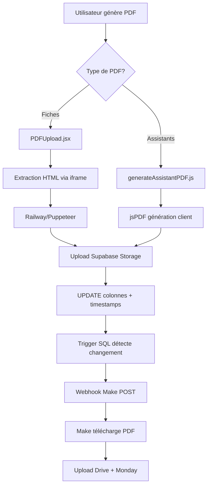

# 📄 SYSTÈME DE GÉNÉRATION PDF - Documentation Complète
*Mise à jour : 26 août 2026*

---

## 🎯 **VUE D'ENSEMBLE**

Système complet de génération et synchronisation PDF pour l'application Fiche Logement, comprenant **deux architectures distinctes** :

### **📋 PDF Fiches (Puppeteer/Railway)**
- **Fiche Logement** : PDF complet avec 23 sections
- **Fiche Ménage** : PDF filtré avec 14 sections spécifiques

### **🤖 PDF Assistants IA (jsPDF client-side)**
- **Guide d'accès** : Généré depuis l'assistant IA (bucket + trigger + Make)
- **Annonce** : Généré par l'agent annonce interne et poussé directement sur Monday par l'Edge Function `annonce-validate` — ni bucket, ni trigger SQL

### **🔄 Synchronisation automatique**
- Upload vers Supabase Storage
- Webhooks Make → Google Drive + Monday.com

---

## 🏗️ **ARCHITECTURE GÉNÉRALE**

### **Workflow Frontend → Backend → Supabase → Make**


```mermaid
graph TD
    A[Utilisateur génère PDF] --> B{Type de PDF?}
    B -->|Fiches| C[PDFUpload.jsx]
    B -->|Assistants| D[generateAssistantPDF.js]
    
    C --> E[Extraction HTML via iframe]
    E --> F[Railway/Puppeteer]
    F --> G[Upload Supabase Storage]
    
    D --> H[jsPDF génération client]
    H --> G
    
    G --> I[UPDATE colonnes + timestamps]
    I --> J[Trigger SQL détecte changement]
    J --> K[Webhook Make POST]
    K --> L[Make télécharge PDF]
    L --> M[Upload Drive + Monday]
```

---

## 📊 **1. PDF FICHES LOGEMENT & MÉNAGE (Puppeteer/Railway)**

### **🎯 Architecture**

**Frontend (React)** → **Routes PDF** → **Extraction HTML** → **Service Railway (Puppeteer)** → **Supabase Storage** → **Trigger DB** → **Webhook Make**

---

### **📁 Composants Frontend**

#### **PDFUpload.jsx** - Orchestrateur principal
```javascript
// Génère 2 PDF simultanément via iframes cachés
const generateAndUploadPDF = async () => {
  // 1. Extraction HTML Logement
  const htmlLogement = await extractHTMLFromIframe(`/print-pdf?fiche=${formData.id}`)
  
  // 2. Extraction HTML Ménage
  const htmlMenage = await extractHTMLFromIframe(`/print-pdf-menage?fiche=${formData.id}`)
  
  // 3. Génération PDF Logement via Railway
  const railwayResponseLogement = await fetch(
    'https://video-compressor-production.up.railway.app/generate-pdf',
    {
      method: 'POST',
      headers: { 'Content-Type': 'application/json' },
      body: JSON.stringify({
        htmlContent: htmlLogement,
        fileName: `fiche-logement-${numeroBien}.pdf`
      })
    }
  )
  
  // 4. Génération PDF Ménage via Railway
  const railwayResponseMenage = await fetch(...)
  
  // 5. Trigger webhook Make
  await triggerPdfWebhook(resultLogement.pdfUrl, resultMenage.pdfUrl)
}
```

**Fonctionnalités clés** :
- ✅ Extraction HTML via iframe invisible
- ✅ Aspiration de tous les styles CSS (Tailwind injecté par Vite)
- ✅ Conversion URLs relatives → absolues (images)
- ✅ Nettoyage des scripts Vite (qui font planter Puppeteer)
- ✅ Timeout 30s pour extraction HTML
- ✅ Attente 3s pour rendu React complet

---

#### **Routes de rendu HTML**

**PrintPDF.jsx** (`/print-pdf`) - Fiche Logement
```javascript
const PrintPDF = () => {
  const [formData, setFormData] = useState(null)
  
  useEffect(() => {
    // PRIORITÉ 1 : sessionStorage (système actuel)
    const sessionData = sessionStorage.getItem('pdf-data')
    if (sessionData) {
      setFormData(JSON.parse(sessionData))
      sessionStorage.removeItem('pdf-data')
      return
    }
    
    // PRIORITÉ 2 : URL parameter (pour Make/webhooks)
    const urlParams = new URLSearchParams(window.location.search)
    const ficheId = urlParams.get('fiche')
    if (ficheId) {
      const result = await loadFiche(ficheId)
      setFormData(result.data)
    }
  }, [])
  
  return <PDFTemplate formData={formData} />
}
```

**PrintPDFMenage.jsx** (`/print-pdf-menage`) - Fiche Ménage
- Même logique que PrintPDF.jsx
- Utilise `PDFMenageTemplate` au lieu de `PDFTemplate`

---

#### **Templates HTML**

**PDFTemplate.jsx** - Fiche complète (23 sections rendues sur 24 collectées)
```javascript
const sectionsConfig = [
  { key: 'section_proprietaire', label: '👤 Propriétaire', emoji: '👤' },
  { key: 'section_logement', label: '🏠 Logement', emoji: '🏠' },
  { key: 'section_avis', label: '⭐ Avis', emoji: '⭐' },
  { key: 'section_clefs', label: '🔑 Clefs', emoji: '🔑' },
  { key: 'section_airbnb', label: '🏠 Airbnb', emoji: '🏠' },
  { key: 'section_booking', label: '📅 Booking', emoji: '📅' },
  { key: 'section_email_outlook', label: '📧 E-mail Outlook', emoji: '📧' },
  { key: 'section_reglementation', label: '📋 Réglementation', emoji: '📋' },
  { key: 'section_exigences', label: '⚠️ Exigences', emoji: '⚠️' },
  { key: 'section_gestion_linge', label: '🧺 Gestion Linge', emoji: '🧺' },
  { key: 'section_consommables', label: '🧴 Consommables', emoji: '🧴' },
  { key: 'section_instructions_menage', label: '🧹 Instructions Ménage', emoji: '🧹' },
  { key: 'section_equipements', label: '⚙️ Équipements', emoji: '⚙️' },
  { key: 'section_visite', label: '🎥 Visite', emoji: '🎥' },
  { key: 'section_chambres', label: '🛏️ Chambres', emoji: '🛏️' },
  { key: 'section_salle_de_bains', label: '🚿 Salle de Bains', emoji: '🚿' },
  { key: 'section_cuisine_1', label: '🍳 Cuisine 1', emoji: '🍳' },
  { key: 'section_cuisine_2', label: '🍽️ Cuisine 2', emoji: '🍽️' },
  { key: 'section_salon_sam', label: '🛋️ Salon / SAM', emoji: '🛋️' },
  { key: 'section_equip_spe_exterieur', label: '🏗️ Équip. Spé. / Extérieur', emoji: '🏗️' },
  { key: 'section_communs', label: '🏢 Communs', emoji: '🏢' },
  { key: 'section_teletravail', label: '💻 Télétravail', emoji: '💻' },
  { key: 'section_bebe', label: '👶 Bébé', emoji: '👶' },
  { key: 'section_securite', label: '🔒 Sécurité', emoji: '🔒' }
]
```

**Fonctionnalités** :
- ✅ Logo Letahost depuis Supabase Storage
- ✅ Extraction intelligente des photos (max 4 par section)
- ✅ Vidéos rendues en liens cliquables (`<a href>` préservé par Puppeteer)
- ✅ Traduction valeurs techniques → humaines
- ✅ Agrégation automatique des lits
- ✅ Rendu groupé pour équipements (TV, Climatisation, etc.)
- ✅ Sections WiFi, Parking, Informations techniques et Équipement ménage dédiées
- ✅ Grille d'évaluation Avis : score, verdict, notes **et observations par critère**

---

#### **⚠️ Règle de complétude du PDF logement**

Le template **n'est pas** une liste de champs écrite à la main : il boucle sur
`sectionsConfig`, puis sur `Object.entries(sectionData)` de chaque section. Un champ
ajouté au formulaire apparaît donc automatiquement dans le PDF — **sauf** s'il tombe
dans un des cas ci-dessous. Ce sont les seuls endroits à vérifier quand un champ
« n'arrive pas » dans le PDF.

| Mécanisme | Effet | Où regarder |
|---|---|---|
| Section absente de `sectionsConfig` | **La section entière disparaît**, sans erreur | `sectionsConfig` |
| `formatValue` : clé contenant `photo`/`video` | Champ écarté du rendu texte (traité comme média) | `formatValue` |
| `isEmpty` : `0` et `"0"` comptent comme vide | Une réponse « 0 » ne s'affiche pas | `isEmpty` |
| Listes d'exclusion `avisExcluded` / `excludedFields` | Champ retiré du rendu générique car rendu dans un bloc dédié | `generateSections` |
| Sections à **rendu groupé** (`section_equipements`, `section_cuisine_1`) | Le rendu générique est **remplacé** : tout champ absent de la liste d'équipements du bloc est invisible | `renderEquipementsGrouped`, `renderCuisine1Grouped` |
| `isImageUrl` / `isVideoUrl` | Une URL média sans extension reconnue n'est ni affichée ni liée | helpers média |

**Conséquence pratique** : ajouter un équipement à `section_equipements` ou
`section_cuisine_1` impose d'ajouter une entrée dans la liste du renderer groupé
correspondant, sinon le champ est collecté, stocké… et jamais restitué.

**Exclusions volontaires** (à ne pas « corriger ») :
- `section_guide_acces` : hors PDF logement (décision produit, juillet 2026)
- `avis.logement_etat_general` / `avis.logement_proprete` : dérivés de la grille, remplacés par le verdict global
- `instructions_menage.a_contacts_maintenance` / `instructions_menage.contacts_maintenance` : destination Monday (board « Artisans / Maintenance »), **jamais** un PDF — cf. la note de confidentialité ci-dessous
- « Rappel des consommables » : bloc dérivé, aucune donnée à rendre — cf. ci-dessous
- Photos au-delà de la 4ᵉ par bloc : remplacées par « +N autres photos disponibles »

**Libellés à maintenir dans LES DEUX templates** : `INSTRUCTIONS_MENAGE_LABELS` et
`INSTRUCTIONS_MENAGE_FOURNISSEUR_LABELS`, déclarés en tête de `PDFTemplate.jsx` **et**
de `PDFMenageTemplate.jsx`. Sans entrée, un champ sort sous son libellé technique
(`Kit Composition`) ; sans entrée dans le second map, un booléen `*_par_prestataire`
sort en « Oui / Non » au lieu de « Propriétaire / Prestataire de ménage ».

---

#### **🧹 Section « Instructions Ménage » — exception de nommage assumée**

La section `section_instructions_menage` (créée en août 2026) regroupe les trois blocs
destinés au prestataire de ménage, auparavant hébergés dans la section Avis : le
pense-bête « Points sensibles à filmer » (UI seule, pas de donnée), la vidéo de l'état
du logement, et le type de 1er ménage / maintenance avec les contacts du propriétaire.

**Motif du déplacement** : la section Avis n'est pas rendue dans le PDF ménage. Le
prestataire ne voyait donc jamais le type de premier ménage ni la vidéo de l'état du
logement — les deux informations dont il a précisément besoin avant sa première
intervention.

**Deux familles de préfixes cohabitent dans cette section, c'est assumé.** Les cinq
champs déplacés restent persistés dans leurs colonnes `avis_*` d'origine ; les champs
ajoutés ensuite (août 2026 : consignes générales, produits et matériel, kit de bienvenue,
points de vigilance) suivent la convention `instructions_menage_*`.

Les colonnes `avis_*` n'ont PAS été renommées :

| Champ FormContext (`section_instructions_menage.*`) | Colonne Supabase |
|---|---|
| `logement_etat_videos` | `avis_logement_etat_videos` |
| `type_premier_menage` | `avis_type_premier_menage` |
| `type_premiere_maintenance` | `avis_type_premiere_maintenance` |
| `a_contacts_maintenance` | `avis_a_contacts_maintenance` |
| `contacts_maintenance` | `avis_contacts_maintenance` |

La convention `{section}_{champ}` est donc volontairement enfreinte pour ces cinq-là.
Renommer impliquerait de toucher `media_manifest` (routage Drive de
`avis_logement_etat_videos`), les préfixes de noms de fichiers déjà présents sur le
Drive, les deux templates PDF et la synchronisation Monday — pour zéro bénéfice
utilisateur. Aucune migration de renommage n'a été faite et aucune n'est prévue.
Le mapping vit dans `mapFormDataToSupabase` / `mapSupabaseToFormData`
(`src/lib/supabaseHelpers.js`).

#### **📋 Le bloc « Rappel des consommables » ne sort d'AUCUN PDF, par construction**

Ce bloc de la section Instructions Ménage est **dérivé**, jamais persisté : pas de
colonne, pas de copie, pas de synchronisation. `buildConsommablesRecap`
(`src/lib/consommablesRecap.js`) le recalcule à chaque rendu depuis
`section_consommables`, donc une modification côté Consommables se voit immédiatement.

Il ne peut donc pas apparaître dans un PDF — il n'y a aucune donnée à rendre. C'est
voulu et pas seulement pratique : la section Consommables **est déjà rendue dans le PDF
ménage**, avec la liste rouge des obligatoires et les « sur demande » cochés. Faire
figurer le rappel en plus afficherait deux fois la même information dans le même
document.

⚠️ Corollaire pour une évolution future : si quelqu'un décide un jour de persister ce
rappel en base « pour simplifier », il devra l'exclure explicitement des deux templates,
sinon le doublon apparaît côté prestataire.

#### **🔒 Contacts de maintenance : filtre obligatoire côté PDF ménage**

Les contacts de maintenance (nom, société, activité, téléphone, email, commentaire)
sont saisis pour le **concierge** et remontés au board Monday « Artisans / Maintenance ».
Le prestataire de ménage ne doit en voir aucun élément.

Avant le déplacement, ils étaient hors du PDF ménage par simple **effet de bord** :
la section Avis qui les hébergeait n'était pas dans `menageSectionsConfig`. Ce n'était
pas un filtre. Depuis que le bloc vit dans une section **qui, elle, est rendue**, la
seule protection est la constante explicite `MENAGE_EXCLUDED_FIELDS` en tête de
`PDFMenageTemplate.jsx`. Elle est appliquée avant tout traitement : champs texte,
extraction photos **et** extraction vidéos. **Ne jamais la retirer.**
Côté PDF logement, ces champs restent exclus comme avant (`avisExcluded` → désormais
`INSTRUCTIONS_MENAGE_CONTACT_FIELDS`).

**PDFMenageTemplate.jsx** - Fiche filtrée (14 sections)
```javascript
const menageSectionsConfig = [
  { key: 'section_proprietaire', label: '👤 Propriétaire', emoji: '👤' },
  { key: 'section_logement', label: '🏠 Logement', emoji: '🏠' },
  { key: 'section_clefs', label: '🔑 Clefs', emoji: '🔑' },
  { key: 'section_gestion_linge', label: '🧺 Gestion Linge', emoji: '🧺' },
  { key: 'section_consommables', label: '🧴 Consommables', emoji: '🧴' },
  { key: 'section_instructions_menage', label: '🧹 Instructions Ménage', emoji: '🧹' },
  { key: 'section_equipements', label: '⚙️ Équipements', emoji: '⚙️' },
  { key: 'section_visite', label: '🎥 Visite', emoji: '🎥' },
  { key: 'section_chambres', label: '🛏️ Chambres', emoji: '🛏️' },
  { key: 'section_salle_de_bains', label: '🚿 Salle de Bains', emoji: '🚿' },
  { key: 'section_cuisine_1', label: '🍳 Cuisine 1', emoji: '🍳' },
  { key: 'section_cuisine_2', label: '🍽️ Cuisine 2', emoji: '🍽️' },
  { key: 'section_salon_sam', label: '🛋️ Salon / SAM', emoji: '🛋️' },
  { key: 'section_equip_spe_exterieur', label: '🏗️ Équip. Spé. / Extérieur', emoji: '🏗️' },
  { key: 'section_securite', label: '🔒 Sécurité', emoji: '🔒' }
]
```

**Fonctionnalités spécifiques ménage** :
- ✅ Photos plus grandes (max 5 par section)
- ✅ Masquage codes confidentiels (masterpinConciergerie, codeProprietaire, codeVoyageur)
- ✅ Liste rouge des consommables obligatoires
- ✅ Filtrage équipements (poubelle, parking uniquement)
- ✅ Vidéos rendues en liens cliquables (depuis août 2026, cf. ci-dessous)
- 🔒 `MENAGE_EXCLUDED_FIELDS` : contacts de maintenance retirés de `section_instructions_menage`

> ⚠️ `PDFMenageTemplate.jsx` est une **copie** de `PDFTemplate.jsx` avec une liste de
> sections réduite : les deux fichiers évoluent séparément. Une correction de rendu
> apportée au PDF logement n'est **pas** répercutée côté ménage.
> État au 31 juillet 2026 : le ménage n'a reçu ni les liens vidéo, ni les correctifs
> de rendu groupé (hotte de cuisine, équipement coché sans détail, ventilateur,
> sèche-serviettes, animaux, PMR, équipement ménage). Vue volontairement filtrée,
> non complétée dans le chantier de complétude du PDF logement.
>
> **Mise à jour août 2026** : le rendu vidéo (`isVideoUrl` / `parseVideoValue` /
> `extractAllVideos` / `VideosDisplayMenage`) a été porté depuis `PDFTemplate.jsx`.
> Sans lui, la vidéo de l'état du logement déplacée dans `section_instructions_menage`
> disparaissait silencieusement du PDF ménage (`extractAllPhotos` filtre sur
> `isImageUrl`, et `formatValue` écarte toute clé contenant `video`) — ce qui vidait
> le déplacement de son intérêt. **Effet de bord assumé** : les vidéos des autres
> sections rendues côté ménage (Visite, Chambres, Clefs…) sortent désormais elles
> aussi en liens. Les correctifs de rendu groupé restent, eux, non portés.

---

### **🚀 Service Railway (Node.js + Puppeteer)**

**Endpoint** : `https://video-compressor-production.up.railway.app/generate-pdf`

#### **server.js** - API Express
```javascript
app.post('/generate-pdf', async (req, res) => {
  const { htmlContent, fileName } = req.body
  
  const result = await generatePDF(htmlContent, fileName)
  
  res.json(result) // { pdfUrl, fileName, size }
})
```

#### **generatePDF.js** - Génération Puppeteer
```javascript
async function generatePDF(htmlContent, fileName) {
  // 1. Écrire HTML dans fichier temporaire
  fs.writeFileSync(tempHtmlPath, htmlContent, 'utf-8')
  
  // 2. Lancer Puppeteer
  const browser = await puppeteer.launch({
    headless: 'new',
    executablePath: '/usr/bin/chromium-browser', // Alpine Docker
    args: ['--no-sandbox', '--disable-setuid-sandbox', '--disable-dev-shm-usage']
  })
  
  const page = await browser.newPage()
  
  // 3. Bloquer les vidéos (éviter de les embarquer dans le PDF)
  await page.setRequestInterception(true)
  page.on('request', (request) => {
    const isVideo = /\.(mp4|webm|ogg|mov|avi|m4v|mkv)$/i.test(request.url())
    if (isVideo) {
      request.abort()
    } else {
      request.continue()
    }
  })
  
  // 4. Charger HTML et attendre images
  await page.goto(`file://${tempHtmlPath}`, {
    waitUntil: 'networkidle0', // Attendre toutes les ressources
    timeout: 120000 // 120 secondes max
  })
  
  // 5. Attendre 3s pour styles
  await new Promise(resolve => setTimeout(resolve, 3000))
  
  // 6. Générer PDF
  const pdfBuffer = await page.pdf({
    format: 'A4',
    printBackground: true,
    margin: { top: '10mm', right: '10mm', bottom: '10mm', left: '10mm' }
  })
  
  // 7. Upload vers Supabase Storage
  const { data, error } = await supabase.storage
    .from('fiche-pdfs')
    .upload(fileName, pdfBuffer, {
      contentType: 'application/pdf',
      cacheControl: '3600',
      upsert: true // Écrase si existe déjà
    })
  
  // 8. Récupérer URL publique
  const { data: urlData } = supabase.storage
    .from('fiche-pdfs')
    .getPublicUrl(fileName)
  
  return {
    pdfUrl: urlData.publicUrl,
    fileName: fileName,
    size: pdfBuffer.length
  }
}
```

**Points techniques** :
- ✅ Chromium Alpine sur Railway
- ✅ Request Interception pour bloquer vidéos
- ✅ `networkidle0` : attend toutes les ressources
- ✅ Timeout 120s pour images distantes
- ✅ Upload direct sur Supabase Storage
- ✅ Upsert : écrase le PDF si régénération

---

### **💾 Storage Supabase**

```
📁 Bucket "fiche-pdfs" (PUBLIC)
├── 📁 assets/
│   └── 📄 letahost-transparent.png (logo)
├── 📄 fiche-logement-7755.pdf
├── 📄 fiche-menage-7755.pdf
└── ...

Pattern nommage : fiche-{type}-{numero_bien}.pdf
```

---

### **🗄️ Base de données**

```sql
-- Colonnes PDF Fiches
pdf_logement_url TEXT
pdf_menage_url TEXT
pdf_last_generated_at TIMESTAMP WITH TIME ZONE
```

---

### **⚡ Trigger SQL**

```sql
-- Fonction : notify_pdf_update()
-- Trigger : fiche_pdf_update_webhook
-- Condition : pdf_last_generated_at change

CREATE OR REPLACE FUNCTION public.notify_pdf_update()
RETURNS trigger
LANGUAGE plpgsql
AS $function$
BEGIN
  IF OLD.pdf_last_generated_at IS DISTINCT FROM NEW.pdf_last_generated_at THEN
    PERFORM net.http_post(
      url := 'https://hook.eu2.make.com/3vmb2eijfjw8nc5y68j8hp3fbw67az9q',
      body := jsonb_build_object(
        'id', NEW.id,
        'nom', NEW.nom,
        'statut', NEW.statut,
        'updated_at', NEW.updated_at,
        'proprietaire', jsonb_build_object(...),
        'logement', jsonb_build_object(...),
        'pdfs', jsonb_build_object(
          'logement_url', NEW.pdf_logement_url,
          'menage_url', NEW.pdf_menage_url
        ),
        'trigger_type', 'pdf_update'
      ),
      headers := '{"Content-Type": "application/json"}'::jsonb
    );
  END IF;
  RETURN NEW;
END;
$function$;
```

---

### **🔄 FormContext.jsx**

```javascript
const triggerPdfWebhook = async (pdfLogementUrl, pdfMenageUrl) => {
  // UPDATE direct Supabase
  const { data, error } = await supabase
    .from('fiches')
    .update({
      pdf_logement_url: pdfLogementUrl,
      pdf_menage_url: pdfMenageUrl,
      pdf_last_generated_at: new Date().toISOString(),
      updated_at: new Date().toISOString()
    })
    .eq('id', formData.id)
    .select()
  
  // Trigger SQL se déclenche automatiquement
  return { success: true, data: data[0] }
}
```

---

## 🤖 **2. PDF ASSISTANTS IA (jsPDF client-side)**

### **🎯 Architecture**

**Frontend (React)** → **jsPDF génération** → **Supabase Storage** → **Trigger DB** → **Webhook Make**

---

### **📁 Composants**

#### **generateAssistantPDF.js** - Bibliothèque jsPDF

**Fonctions principales** :
- `generateGuideAccesPDF(content, metadata, ficheId)` : Génère le PDF guide d'accès et l'uploade dans le bucket `guide-acces-pdfs`
- `buildAnnonceStructuredPdfBase64({ outputAssemble, plateforme, metadata })` : Fabrique le PDF de l'agent annonce et le renvoie en base64, sans upload bucket

⚠️ `renderHeader`, `renderFooter` et `renderContent` sont **partagés** par les deux. Une retouche de ces helpers pour le guide d'accès change aussi le PDF de l'annonce, et réciproquement.

**Exemple : generateGuideAccesPDF**
```javascript
import { jsPDF } from 'jspdf'
import { supabase } from './supabaseClient'

export const generateGuideAccesPDF = async (content, metadata, ficheId) => {
  // 1. Créer document jsPDF
  const doc = new jsPDF('p', 'mm', 'a4')
  
  // 2. Render header (logo, titre, métadonnées)
  let yPos = renderHeader(doc, 'guide', metadata)
  
  // 3. Render contenu (détection titres : majuscules OU deux points)
  yPos = renderContent(doc, content, yPos)
  
  // 4. Render footer (numéro page, infos)
  renderFooter(doc, 'guide', metadata)
  
  // 5. Générer blob PDF
  const pdfBlob = doc.output('blob')
  const fileName = `guide_acces_${ficheId}.pdf`
  
  // 6. Upload vers Supabase Storage
  const { error: uploadError } = await supabase.storage
    .from('guide-acces-pdfs')
    .upload(fileName, pdfBlob, {
      contentType: 'application/pdf',
      upsert: true
    })
  
  if (uploadError) throw uploadError
  
  // 7. Récupérer URL publique
  const { data: { publicUrl } } = supabase.storage
    .from('guide-acces-pdfs')
    .getPublicUrl(fileName)
  
  return publicUrl
}
```

**Fonctionnalités** :
- ✅ Génération 100% client-side (pas de backend)
- ✅ Détection intelligente des titres (majuscules OU deux points)
- ✅ Pagination automatique avec `checkPageBreak()`
- ✅ Wrapping manuel du texte
- ✅ Header/Footer personnalisés
- ✅ Palette couleurs Letahost (#dbae61)

---

#### **FicheGuideAcces.jsx** - Page Guide d'accès

```javascript
import { generateGuideAccesPDF } from '../lib/generateAssistantPDF'

const handleValidateGuide = async () => {
  // 1. Nettoyer contenu IA
  const cleanedContent = message.content
    .replace(/([^\s]):/g, '$1 :') // Espace avant deux points
    .replace(/\u00A0/g, ' ') // Remplacer espaces insécables
  
  // 2. Générer PDF
  const pdfUrl = await generateGuideAccesPDF(
    cleanedContent,
    metadata,
    formData.id
  )
  
  // 3. Déclencher webhook
  const result = await triggerAssistantPdfWebhook(pdfUrl, null)
}
```

---

### **💾 Storage Supabase**

```
📁 Bucket "guide-acces-pdfs" (PUBLIC)
├── 📄 guide_acces_6ce4732b-1062-4f43-bc4d-e91aff9f32c9.pdf
└── ...

📁 Bucket "annonce-pdfs" (PUBLIC) — ⚠️ DÉPRÉCIÉ
└── plus aucun code n'y écrit ni n'y lit depuis le retrait de l'ancien
    agent annonce (août 2026). Suppression manuelle à faire.
```

---

### **🗄️ Base de données**

```sql
-- Colonnes PDF Assistants
guide_acces_pdf_url TEXT
guide_acces_last_generated_at TIMESTAMP WITH TIME ZONE

-- ⚠️ ORPHELINES : encore présentes en base, plus référencées par aucune ligne de
-- code depuis le retrait de l'ancien agent annonce (août 2026). Suppression, avec
-- le trigger fiche_annonce_pdf_webhook :
-- docs/migrations/2026-08-26_retrait_ancien_agent_annonce.sql (à appliquer à la main).
annonce_pdf_url TEXT
annonce_last_generated_at TIMESTAMP WITH TIME ZONE
```

---

### **⚡ Triggers SQL (1 vivant, 1 orphelin)**

#### **Trigger Guide d'accès**
```sql
-- Fonction : notify_guide_acces_pdf_update()
-- Trigger : fiche_guide_acces_pdf_webhook
-- Condition : guide_acces_last_generated_at change

CREATE OR REPLACE FUNCTION public.notify_guide_acces_pdf_update()
RETURNS trigger
LANGUAGE plpgsql
AS $function$
BEGIN
  IF OLD.guide_acces_last_generated_at IS DISTINCT FROM NEW.guide_acces_last_generated_at THEN
    PERFORM net.http_post(
      url := 'https://hook.eu2.make.com/wjonl6ikb3fl8sk2tr5k7f95lupo4t6z',
      body := jsonb_build_object(
        'id', NEW.id,
        'nom', NEW.nom,
        'assistant_pdf', jsonb_build_object(
          'url', NEW.guide_acces_pdf_url,
          'type', 'guide_acces',
          'last_generated_at', NEW.guide_acces_last_generated_at
        ),
        'trigger_type', 'assistant_pdf_update',
        'pdf_type', 'guide_acces'
      ),
      headers := '{"Content-Type": "application/json"}'::jsonb
    );
  END IF;
  RETURN NEW;
END;
$function$;
```

#### **Trigger Annonce — ⚠️ ORPHELIN**

- **Fonction :** `notify_annonce_pdf_update()`
- **Trigger :** `fiche_annonce_pdf_webhook` sur `public.fiches`
- **Condition :** `annonce_last_generated_at` change

Encore présent en base, mais **plus jamais déclenché** : depuis le retrait de l'ancien agent annonce (août 2026), plus aucune ligne de code n'écrit dans `annonce_last_generated_at`. Son retrait, avec la fonction et les deux colonnes, se fait par `docs/migrations/2026-08-26_retrait_ancien_agent_annonce.sql`, à appliquer à la main après le précontrôle du même dossier. Ne pas confondre avec son jumeau `fiche_guide_acces_pdf_webhook`, qui reste vivant.

---

### **🔄 FormContext.jsx**

```javascript
const triggerAssistantPdfWebhook = async (guideAccesUrl) => {
  const updateData = {}
  
  if (guideAccesUrl) {
    updateData.guide_acces_pdf_url = guideAccesUrl
    updateData.guide_acces_last_generated_at = new Date().toISOString()
  }
  
  updateData.updated_at = new Date().toISOString()
  
  const { data, error } = await supabase
    .from('fiches')
    .update(updateData)
    .eq('id', formData.id)
    .select()
  
  // Triggers SQL se déclenchent automatiquement
  return { success: true, data: data[0] }
}
```

---

## 🔧 **MAPPING SUPABASEHELPERS.JS**

### **mapFormDataToSupabase**
```javascript
// PDF Fiches
pdf_logement_url: formData.pdf_logement_url || null,
pdf_menage_url: formData.pdf_menage_url || null,
// pdf_last_generated_at: NE PAS MAPPER (géré par triggerPdfWebhook)

// PDF Assistants
guide_acces_pdf_url: formData.guide_acces_pdf_url || null,
// guide_acces_last_generated_at: NE PAS MAPPER (géré par triggerAssistantPdfWebhook)
```

### **mapSupabaseToFormData**
```javascript
// PDF Fiches
pdf_logement_url: supabaseData.pdf_logement_url || null,
pdf_menage_url: supabaseData.pdf_menage_url || null,
pdf_last_generated_at: supabaseData.pdf_last_generated_at,

// PDF Assistants
guide_acces_pdf_url: supabaseData.guide_acces_pdf_url || null,
guide_acces_last_generated_at: supabaseData.guide_acces_last_generated_at,
```

---

## 📦 **RÉCAPITULATIF DES WEBHOOKS MAKE**

| Type | Webhook URL | Trigger | Payload |
|------|------------|---------|---------|
| PDF Fiches | `https://hook.eu2.make.com/3vmb2eijfjw8nc5y68j8hp3fbw67az9q` | `pdf_last_generated_at` change | Logement + Ménage URLs |
| PDF Guide d'accès | `https://hook.eu2.make.com/wjonl6ikb3fl8sk2tr5k7f95lupo4t6z` | `guide_acces_last_generated_at` change | Guide URL + `pdf_type: 'guide_acces'` |
| PDF Annonce ⚠️ orphelin | `https://hook.eu2.make.com/wjonl6ikb3fl8sk2tr5k7f95lupo4t6z` | `annonce_last_generated_at` change — plus jamais écrit | Annonce URL + `pdf_type: 'annonce'` |

---

## 🔍 **COMPARAISON DES DEUX SYSTÈMES**

| Aspect | PDF Fiches (Puppeteer) | PDF Assistants (jsPDF) |
|--------|------------------------|------------------------|
| **Technologie** | Puppeteer (Node.js) | jsPDF (JavaScript) |
| **Localisation** | Service Railway externe | Client-side (navigateur) |
| **Input** | HTML complet (React) | Texte brut (IA) |
| **Avantages** | Rendu parfait, styles CSS, images | Rapide, léger, pas de backend |
| **Inconvénients** | Lent (3-5s), dépendance externe | Mise en page manuelle |
| **Use case** | Fiches complexes avec photos | Documents texte simples |

---

## ✅ **TESTS VALIDÉS**

### **PDF Fiches**
- ✅ Génération simultanée Logement + Ménage
- ✅ Extraction HTML via iframe (sessionStorage + URL param)
- ✅ Transformation URLs relatives → absolues
- ✅ Nettoyage scripts Vite
- ✅ Upload Storage avec upsert
- ✅ Trigger webhook déclenché correctement
- ✅ Make télécharge et organise sur Drive/Monday
- ✅ Regénération fonctionne (même URLs)
- ✅ Logo Supabase Storage affiché correctement
- ✅ Blocage vidéos dans Puppeteer

### **PDF Assistants**
- ✅ Génération Guide d'accès depuis IA
- ✅ Upload Storage avec upsert
- ✅ Trigger guide d'accès fonctionnel
- ✅ Make route selon `pdf_type`
- ✅ Timestamps mis à jour correctement
- ✅ Regénération fonctionne (même URLs)
- ✅ Détection titres (majuscules + deux points)
- ✅ Pagination automatique

---

## 🎯 **AVANTAGES DU SYSTÈME**

- ✅ **Deux architectures adaptées** : Puppeteer pour complexité, jsPDF pour simplicité
- ✅ **Workflow unifié** : Même pattern de webhook pour tous les PDFs
- ✅ **Triggers indépendants** : Pas d'interférence entre PDF types
- ✅ **Regénération illimitée** : Timestamps garantissent le déclenchement
- ✅ **Make optimisé** : Routage intelligent selon type
- ✅ **Storage organisé** : Buckets dédiés par type
- ✅ **Upsert automatique** : Pas d'accumulation de fichiers
- ✅ **Scalabilité** : Service Railway indépendant
- ✅ **Résilience** : Fallback sessionStorage + URL param

---

## 🚨 **POINTS D'ATTENTION**

### **PDF Fiches (Puppeteer)**
- ⚠️ **Timeout** : 120s max pour chargement images
- ⚠️ **Scripts Vite** : Doivent être nettoyés avant envoi
- ⚠️ **URLs relatives** : Doivent être converties en absolues
- ⚠️ **Service externe** : Dépendance à Railway
- ⚠️ **Vidéos** : Bloquées automatiquement (pas dans PDF)

### **PDF Assistants (jsPDF)**
- ⚠️ **Mise en page** : Wrapping manuel du texte
- ⚠️ **Pagination** : Gestion manuelle des page breaks
- ⚠️ **Styles limités** : Pas de CSS, uniquement fonts/couleurs
- ⚠️ **Images** : Difficile à intégrer (base64 requis)

---

*📝 Document maintenu à jour - Dernière mise à jour : 12 février 2026*  
*🎯 Système PDF complet opérationnel en production*