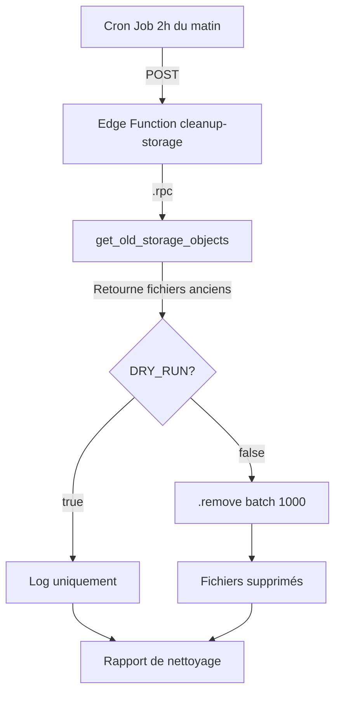

# 📊 SUPABASE SPEC - Fiche Logement
*Architecture technique - Mise à jour : 12 février 2026*

---

## 🎯 **ARCHITECTURE GÉNÉRALE**

Application React + Supabase pour remplacer les formulaires Jotform. 24 sections de formulaire avec upload média, génération PDF automatique (4 types) et 4 systèmes de webhooks indépendants vers Make.com.

**Stack :**
- Frontend : React + Vite + Tailwind
- Backend : Supabase (PostgreSQL + Auth + Storage)
- Automatisation : Make.com (4 webhooks séparés)
- PDF : html2pdf.js + jsPDF

---

## 🗄️ **BASE DE DONNÉES**

### **Architecture : Table Plate 750+ Colonnes**
Une seule table `fiches` avec pattern de nommage `{section}_{champ}`.

```sql
-- Table principale
CREATE TABLE fiches (
  -- Métadonnées
  id UUID DEFAULT gen_random_uuid() PRIMARY KEY,
  user_id UUID REFERENCES auth.users(id),
  nom TEXT DEFAULT 'Nouvelle fiche',
  statut TEXT DEFAULT 'Brouillon' CHECK (statut IN ('Brouillon', 'Complété', 'Archivé')),
  created_at TIMESTAMP WITH TIME ZONE DEFAULT NOW(),
  updated_at TIMESTAMP WITH TIME ZONE DEFAULT NOW(),
  
  -- PDF Fiches Logement/Ménage
  pdf_last_generated_at TIMESTAMP WITH TIME ZONE,
  pdf_logement_url TEXT,
  pdf_menage_url TEXT,
  
  -- PDF Assistants IA
  guide_acces_pdf_url TEXT,
  guide_acces_last_generated_at TIMESTAMP WITH TIME ZONE,
  annonce_pdf_url TEXT,
  annonce_last_generated_at TIMESTAMP WITH TIME ZONE,
  
  -- Sections (pattern {section}_{champ})
  proprietaire_prenom TEXT,
  proprietaire_nom TEXT,
  proprietaire_email TEXT,
  logement_numero_bien TEXT,
  logement_type_propriete TEXT,
  logement_surface INTEGER,
  
  -- Champs d'alertes critiques
  equipements_wifi_statut TEXT,
  avis_quartier_securite TEXT,
  avis_logement_etat_general TEXT,
  
  -- Champs média (TEXT[] pour photos/vidéos)
  clefs_photos TEXT[],
  equipements_poubelle_photos TEXT[],
  chambres_chambre_1_photos_chambre TEXT[],
  guide_acces_video_acces TEXT[],
  -- ... 94 champs média au total
);

-- Table utilisateurs
CREATE TABLE profiles (
  id UUID REFERENCES auth.users(id) PRIMARY KEY,
  role TEXT DEFAULT 'coordinateur' CHECK (role IN ('coordinateur', 'admin', 'super_admin')),
  prenom TEXT,
  nom TEXT,
  email TEXT
);
```

### **Mapping Bidirectionnel**

```javascript
// FormContext → Supabase  
export const mapFormDataToSupabase = (formData) => ({
  nom: formData.nom || 'Nouvelle fiche',
  logement_numero_bien: formData.section_logement?.numero_bien || null,
  clefs_photos: formData.section_clefs?.photos || [],
  
  // ⚠️ CRITIQUE : Les timestamps PDF ne doivent JAMAIS être mappés ici
  // Ils sont gérés UNIQUEMENT par triggerPdfWebhook() et triggerAssistantPdfWebhook()
  pdf_logement_url: formData.pdf_logement_url || null,
  pdf_menage_url: formData.pdf_menage_url || null,
  guide_acces_pdf_url: formData.guide_acces_pdf_url || null,
  annonce_pdf_url: formData.annonce_pdf_url || null,
  // pdf_last_generated_at: JAMAIS mappé
  // guide_acces_last_generated_at: JAMAIS mappé
  // annonce_last_generated_at: JAMAIS mappé
})

// Supabase → FormContext
export const mapSupabaseToFormData = (supabaseData) => ({
  section_logement: {
    numero_bien: supabaseData.logement_numero_bien || "",
  },
  section_clefs: {
    photos: supabaseData.clefs_photos || [],
  },
  // Timestamps OK en lecture
  pdf_last_generated_at: supabaseData.pdf_last_generated_at,
  guide_acces_last_generated_at: supabaseData.guide_acces_last_generated_at,
  annonce_last_generated_at: supabaseData.annonce_last_generated_at,
})
```

---

## 🔗 **SYSTÈME DE TRIGGERS (4 WEBHOOKS INDÉPENDANTS)**

### **1. Trigger Principal - Photos/Vidéos Drive/Monday**

**Déclenchement :** Statut passe à "Complété" (finalisation uniquement)  
**Webhook :** `https://hook.eu2.make.com/ydjwftmd7czs4rygv1rjhi6u4pvb4gdj`

```sql
CREATE OR REPLACE FUNCTION public.notify_fiche_completed()
RETURNS trigger
LANGUAGE plpgsql
AS $function$
BEGIN
  IF NEW.statut = 'Complété' AND OLD.statut IS DISTINCT FROM 'Complété' THEN
    PERFORM net.http_post(
      url := 'https://hook.eu2.make.com/ydjwftmd7czs4rygv1rjhi6u4pvb4gdj',
      body := jsonb_build_object(
        'id', NEW.id,
        'nom', NEW.nom,
        'statut', NEW.statut,
        'proprietaire', jsonb_build_object(...),
        'logement', jsonb_build_object(...),
        'pdfs', jsonb_build_object(
          'logement_url', NEW.pdf_logement_url,
          'menage_url', NEW.pdf_menage_url
        ),
        'media', jsonb_build_object(
          -- 94 champs média structurés
        )
      ),
      headers := '{"Content-Type": "application/json"}'::jsonb
    );
  END IF;
  RETURN NEW;
END;
$function$;

CREATE TRIGGER fiche_any_update_webhook
  AFTER UPDATE ON public.fiches
  FOR EACH ROW
  EXECUTE FUNCTION notify_fiche_completed();
```

### **2. Trigger PDF Fiches - Logement/Ménage**

**Déclenchement :** `pdf_last_generated_at` change  
**Webhook :** `https://hook.eu2.make.com/3vmb2eijfjw8nc5y68j8hp3fbw67az9q`

```sql
CREATE OR REPLACE FUNCTION public.notify_pdf_update()
RETURNS trigger
LANGUAGE plpgsql
AS $function$
BEGIN
  IF OLD.pdf_last_generated_at IS DISTINCT FROM NEW.pdf_last_generated_at THEN
    PERFORM net.http_post(
      url := 'https://hook.eu2.make.com/3vmb2eijfjw8nc5y68j8hp3fbw67az9q',
      body := jsonb_build_object(
        'id', NEW.id,
        'nom', NEW.nom,
        'statut', NEW.statut,
        'updated_at', NEW.updated_at,
        'proprietaire', jsonb_build_object(...),
        'logement', jsonb_build_object(
          'numero_bien', NEW.logement_numero_bien
        ),
        'pdfs', jsonb_build_object(
          'logement_url', NEW.pdf_logement_url,
          'menage_url', NEW.pdf_menage_url
        ),
        'trigger_type', 'pdf_update'
      ),
      headers := '{"Content-Type": "application/json"}'::jsonb
    );
  END IF;
  RETURN NEW;
END;
$function$;

CREATE TRIGGER fiche_pdf_update_webhook
  AFTER UPDATE ON public.fiches
  FOR EACH ROW
  EXECUTE FUNCTION notify_pdf_update();
```

### **3. Trigger PDF Guide d'Accès**

**Déclenchement :** `guide_acces_last_generated_at` change  
**Webhook :** `https://hook.eu2.make.com/wjonl6ikb3fl8sk2tr5k7f95lupo4t6z`

```sql
CREATE OR REPLACE FUNCTION public.notify_guide_acces_pdf_update()
RETURNS trigger
LANGUAGE plpgsql
AS $function$
BEGIN
  IF OLD.guide_acces_last_generated_at IS DISTINCT FROM NEW.guide_acces_last_generated_at THEN
    PERFORM net.http_post(
      url := 'https://hook.eu2.make.com/wjonl6ikb3fl8sk2tr5k7f95lupo4t6z',
      body := jsonb_build_object(
        'id', NEW.id,
        'nom', NEW.nom,
        'assistant_pdf', jsonb_build_object(
          'url', NEW.guide_acces_pdf_url,
          'type', 'guide_acces',
          'last_generated_at', NEW.guide_acces_last_generated_at
        ),
        'trigger_type', 'assistant_pdf_update',
        'pdf_type', 'guide_acces'
      ),
      headers := '{"Content-Type": "application/json"}'::jsonb
    );
  END IF;
  RETURN NEW;
END;
$function$;

CREATE TRIGGER fiche_guide_acces_pdf_webhook
  AFTER UPDATE ON public.fiches
  FOR EACH ROW
  EXECUTE FUNCTION notify_guide_acces_pdf_update();
```

### **4. Trigger PDF Annonce**

**Déclenchement :** `annonce_last_generated_at` change  
**Webhook :** `https://hook.eu2.make.com/wjonl6ikb3fl8sk2tr5k7f95lupo4t6z`

```sql
CREATE OR REPLACE FUNCTION public.notify_annonce_pdf_update()
RETURNS trigger
LANGUAGE plpgsql
AS $function$
BEGIN
  IF OLD.annonce_last_generated_at IS DISTINCT FROM NEW.annonce_last_generated_at THEN
    PERFORM net.http_post(
      url := 'https://hook.eu2.make.com/wjonl6ikb3fl8sk2tr5k7f95lupo4t6z',
      body := jsonb_build_object(
        'id', NEW.id,
        'nom', NEW.nom,
        'assistant_pdf', jsonb_build_object(
          'url', NEW.annonce_pdf_url,
          'type', 'annonce',
          'last_generated_at', NEW.annonce_last_generated_at
        ),
        'trigger_type', 'assistant_pdf_update',
        'pdf_type', 'annonce'
      ),
      headers := '{"Content-Type": "application/json"}'::jsonb
    );
  END IF;
  RETURN NEW;
END;
$function$;

CREATE TRIGGER fiche_annonce_pdf_webhook
  AFTER UPDATE ON public.fiches
  FOR EACH ROW
  EXECUTE FUNCTION notify_annonce_pdf_update();
```

### **5. Trigger Alertes (Optionnel)**

**Déclenchement :** Finalisation OU modification des 12 champs d'alertes  
**Webhook :** `https://hook.eu2.make.com/b935os296umo923k889s254wb88wjxn4`

**Champs surveillés :**
- 🔴 **Critiques (4)** : `avis_quartier_securite`, `avis_logement_etat_general`, `avis_logement_proprete`, `equipements_wifi_statut`
- 🟡 **Modérées (8)** : `avis_video_globale_validation`, `avis_quartier_types`, `avis_immeuble_etat_general`, etc.

---

## 📦 **TABLEAU RÉCAPITULATIF DES TRIGGERS**

| Trigger | Condition | Webhook | Payload Principal |
|---------|-----------|---------|-------------------|
| **Finalisation** | `statut` → "Complété" | `ydjwftmd7czs4rygv1rjhi6u4pvb4gdj` | 94 champs média + PDFs |
| **PDF Fiches** | `pdf_last_generated_at` change | `3vmb2eijfjw8nc5y68j8hp3fbw67az9q` | URLs Logement + Ménage |
| **PDF Guide** | `guide_acces_last_generated_at` change | `wjonl6ikb3fl8sk2tr5k7f95lupo4t6z` | URL + `pdf_type: 'guide_acces'` |
| **PDF Annonce** | `annonce_last_generated_at` change | `wjonl6ikb3fl8sk2tr5k7f95lupo4t6z` | URL + `pdf_type: 'annonce'` |
| **Alertes** | Finalisation OU champs alertes | `b935os296umo923k889s254wb88wjxn4` | 12 champs d'alertes |

---

## 📸 **GESTION STORAGE SUPABASE**

### **Buckets Publics**

```
📁 fiche-photos (PUBLIC)
└── user-{user_id}/
    └── fiche-{numero_bien}/
        └── section/field/
            └── fichiers.jpg

📁 fiche-pdfs (PUBLIC)
├── fiche-logement-{numero_bien}.pdf
└── fiche-menage-{numero_bien}.pdf

📁 guide-acces-pdfs (PUBLIC)
└── guide_acces_{ficheId}.pdf

📁 annonce-pdfs (PUBLIC)
└── annonce_{ficheId}.pdf
```

### **94 Champs Média Total**

#### Clefs (5)
- clefs_emplacement_photo, clefs_interphone_photo, clefs_tempo_gache_photo, clefs_digicode_photo, clefs_photos

#### Équipements (18)
- equipements_poubelle_photos, equipements_disjoncteur_photos, equipements_vanne_eau_photos, equipements_wifi_routeur_photo, equipements_parking_photos/videos, equipements_tv_video, equipements_climatisation_video, etc.

#### Chambres/SDB (12)
- chambres_chambre_[1-6]_photos_chambre, salle_de_bains_salle_de_bain_[1-6]_photos_salle_de_bain

#### Cuisine (21)
- 14 vidéos tutos + 6 photos + cuisine_2_photos_tiroirs_placards

#### Autres sections (17)
- salon_sam, exterieur, jacuzzi, barbecue, piscine_video, communs, bebe, visite_video, guide_acces (photos + video), securite, linge

#### Éléments abîmés (21)
- avis_video_globale_videos, avis_logement_vis_a_vis_photos, cuisine_1_elements_abimes_photos, salon/chambres/sdb/exterieur elements_abimes_photos

---

## 🧹 **STORAGE CLEANUP AUTOMATIQUE**

### **Contexte**
Le storage Supabase avait atteint **107 GB** (limite 100 GB dépassée). Un système de cleanup automatique a été mis en place pour nettoyer les fichiers anciens selon des règles de rétention.

### **Architecture du Système**

#### **1. Fonction SQL : `get_old_storage_objects`**

Fonction `SECURITY DEFINER` dans le schéma `public` permettant d'accéder à `storage.objects` depuis les Edge Functions.

```sql
CREATE OR REPLACE FUNCTION public.get_old_storage_objects(
  p_bucket_id TEXT,
  p_cutoff TIMESTAMPTZ,
  p_limit INT DEFAULT 1000
)
RETURNS TABLE(name TEXT, size BIGINT)
LANGUAGE plpgsql
SECURITY DEFINER
AS $$
BEGIN
  RETURN QUERY
  SELECT 
    objects.name,
    (objects.metadata->>'size')::bigint as size
  FROM storage.objects
  WHERE bucket_id = p_bucket_id
    AND created_at < p_cutoff
  ORDER BY created_at ASC
  LIMIT p_limit;
END;
$$;
```

**Raison d'existence :** `storage.objects` n'est pas accessible via l'API REST Supabase (erreur PGRST106). C'est le **seul moyen** d'accéder à ces données depuis une Edge Function via `.rpc()`.

#### **2. Edge Function : `cleanup-storage`**

Fonction déployée dans Supabase qui effectue le nettoyage automatique.

**Paramètres de rétention :**
- **Photos** (`fiche-photos`) : 90 jours
- **PDFs** (`fiche-pdfs`) : 7 jours

**Fonctionnement :**
1. Appelle `get_old_storage_objects()` via `.rpc()` pour récupérer les fichiers anciens
2. Supprime les fichiers par batch de **1000 max** (limite Supabase) via `.remove()`
3. Flag `DRY_RUN` en haut du fichier pour tester sans supprimer

```typescript
// supabase/functions/cleanup-storage/index.ts
const DRY_RUN = false // Mettre à true pour tester

const RETENTION_POLICIES = {
  'fiche-photos': 90,  // 90 jours
  'fiche-pdfs': 7      // 7 jours
}

// Récupération via RPC (seul moyen d'accéder à storage.objects)
const { data: oldFiles } = await supabase.rpc('get_old_storage_objects', {
  p_bucket_id: bucketId,
  p_cutoff: cutoffDate,
  p_limit: 1000
})

// Suppression via API Storage (JAMAIS via SQL DELETE = fichiers orphelins)
if (!DRY_RUN) {
  await supabase.storage.from(bucketId).remove(filePaths)
}
```

#### **3. Cron Job : `cleanup-storage-daily`**

Planification automatique du nettoyage tous les soirs à 2h du matin.

```sql
-- Configuration dans Supabase Dashboard > Database > Cron Jobs
SELECT cron.schedule(
  'cleanup-storage-daily',
  '0 2 * * *',  -- Tous les jours à 2h du matin
  $$
  SELECT net.http_post(
    url := 'https://[PROJECT_REF].supabase.co/functions/v1/cleanup-storage',
    headers := jsonb_build_object(
      'Content-Type', 'application/json',
      'Authorization', 'Bearer [ANON_KEY]'
    )
  );
  $$
);
```

### **Règles Critiques**

> [!CAUTION]
> **Ne JAMAIS faire `DELETE FROM storage.objects` via SQL**
> 
> Le trigger `protect_delete` sur `storage.objects` interdit les suppressions directes. Toujours utiliser l'API `.remove()` pour supprimer des fichiers.

> [!IMPORTANT]
> **Accès à `storage.objects`**
> 
> - `storage.objects` n'est **pas accessible** via l'API REST Supabase (erreur PGRST106)
> - Seule solution : fonction SQL `SECURITY DEFINER` appelée via `.rpc()`
> - Les stats du dashboard Supabase peuvent mettre **jusqu'à 1h** à se rafraîchir

### **Monitoring du Storage**

**Source de vérité pour le storage :**

```sql
-- Taille totale par bucket (en GB)
SELECT 
  bucket_id,
  (sum((metadata->>'size')::bigint) / 1024.0 / 1024.0 / 1024.0)::numeric(10,2) as total_gb
FROM storage.objects
GROUP BY bucket_id
ORDER BY total_gb DESC;
```

**Résultat attendu :**
```
bucket_id      | total_gb
---------------|----------
fiche-photos   | 45.23
fiche-pdfs     | 2.15
guide-acces-pdfs | 0.87
annonce-pdfs   | 0.34
```

### **Workflow de Nettoyage**


```mermaid
graph TD
    A[Cron Job 2h du matin] -->|POST| B[Edge Function cleanup-storage]
    B -->|.rpc| C[get_old_storage_objects]
    C -->|Retourne fichiers anciens| D{DRY_RUN?}
    D -->|true| E[Log uniquement]
    D -->|false| F[.remove batch 1000]
    F --> G[Fichiers supprimés]
    E --> H[Rapport de nettoyage]
    G --> H
```

---

## 🔐 **AUTHENTIFICATION & PERMISSIONS**

### **RLS Policies**

```sql
-- Coordinateur : accès seulement à ses fiches
CREATE POLICY "coordinateur_own_fiches" ON fiches 
  FOR ALL USING (user_id = auth.uid());

-- Super admin : accès toutes fiches
CREATE POLICY "super_admin_all_fiches" ON fiches 
  FOR ALL USING (
    EXISTS (
      SELECT 1 FROM auth.users 
      WHERE id = auth.uid() 
      AND raw_user_meta_data->>'role' = 'super_admin'
    )
  );
```

### **Hooks FormContext Critiques**

```javascript
// Trigger PDF Fiches (Logement/Ménage)
const triggerPdfWebhook = async (pdfLogementUrl, pdfMenageUrl) => {
  await supabase
    .from('fiches')
    .update({
      pdf_logement_url: pdfLogementUrl,
      pdf_menage_url: pdfMenageUrl,
      pdf_last_generated_at: new Date().toISOString(), // SEUL endroit
      updated_at: new Date().toISOString()
    })
    .eq('id', formData.id)
}

// Trigger PDF Assistants (Guide/Annonce)
const triggerAssistantPdfWebhook = async (guideAccesUrl, annonceUrl) => {
  const updateData = {}
  
  if (guideAccesUrl) {
    updateData.guide_acces_pdf_url = guideAccesUrl
    updateData.guide_acces_last_generated_at = new Date().toISOString()
  }
  
  if (annonceUrl) {
    updateData.annonce_pdf_url = annonceUrl
    updateData.annonce_last_generated_at = new Date().toISOString()
  }
  
  updateData.updated_at = new Date().toISOString()
  
  await supabase.from('fiches').update(updateData).eq('id', formData.id)
}

// Sauvegarde normale (N'ÉCRASE JAMAIS les timestamps PDF)
const handleSave = async () => {
  const supabaseData = mapFormDataToSupabase(formData) // Timestamps absents
  await saveFiche(supabaseData)
}
```

---

## ✅ **TESTS VALIDÉS**

### **Triggers Isolés (16 Oct 2025)**
- ✅ **Fix pdf_last_generated_at** : Suppression du mapping dans mapFormDataToSupabase()
- ✅ **4 triggers indépendants** : Aucune interférence entre eux
- ✅ **Regénération PDF** : Fonctionne correctement via timestamps
- ✅ **Cohérence local/prod** : Comportements identiques

### **PDF Assistants (17 Nov 2025)**
- ✅ **Génération Guide d'accès** : Trigger déclenché correctement
- ✅ **Génération Annonce** : Trigger déclenché correctement
- ✅ **Timestamps** : Mise à jour correcte
- ✅ **Routage Make** : `pdf_type` permet le filtrage

---

## 🎯 **COMPORTEMENTS ATTENDUS**

| Action | Trigger Finalisation | Trigger PDF Fiches | Trigger Guide | Trigger Annonce | Trigger Alertes |
|--------|---------------------|-------------------|---------------|-----------------|-----------------|
| Finalisation (Brouillon → Complété) | ✅ | ❌ | ❌ | ❌ | ✅ |
| Génération PDF Fiches | ❌ | ✅ | ❌ | ❌ | ❌ |
| Génération PDF Guide | ❌ | ❌ | ✅ | ❌ | ❌ |
| Génération PDF Annonce | ❌ | ❌ | ❌ | ✅ | ❌ |
| Modification champ alerte (Complété) | ❌ | ❌ | ❌ | ❌ | ✅ |
| Sauvegarde normale | ❌ | ❌ | ❌ | ❌ | ❌ |

---

# 🧹 Système de Cleanup Storage Supabase

> Mis en place le 12 février 2026 suite à une saturation du storage (107 GB / 100 GB limite).

---

## 📊 Contexte

Le storage Supabase avait atteint **107 GB** (limite plan Pro = 100 GB), bloquant tous les uploads.

**Répartition du storage :**
| Type | Fichiers | Volume |
|------|----------|--------|
| Photos | 12 317 | 67 GB |
| Vidéos | 740 | 40 GB |
| PDFs fiches | - | ~2 GB |
| **Total** | | **~107 GB** |

**Taux d'upload :** ~4 GB/nuit avec les coordinateurs actifs.

---

## 🏗️ Architecture du système

### Flux complet
```
Cron SQL (2h du matin)
  → Appelle Edge Function cleanup-storage
    → .rpc('get_old_storage_objects') sur chaque bucket
      → Retourne liste fichiers > cutoff
        → .remove() sur les fichiers trouvés
```

---

## 🗄️ Fonction SQL : `get_old_storage_objects`

```sql
CREATE OR REPLACE FUNCTION public.get_old_storage_objects(
  p_bucket_id TEXT,
  p_cutoff TIMESTAMPTZ,
  p_limit INT DEFAULT 1000
)
RETURNS TABLE(name TEXT, size BIGINT)
LANGUAGE SQL
SECURITY DEFINER
AS $$
  SELECT name, (metadata->>'size')::bigint as size
  FROM storage.objects
  WHERE bucket_id = p_bucket_id
  AND created_at < p_cutoff
  AND name NOT LIKE 'assets/%'
  ORDER BY created_at ASC
  LIMIT p_limit;
$$;
```

### Pourquoi cette fonction existe ?
`storage.objects` n'est **pas accessible** via l'API REST Supabase JS depuis une Edge Function.
Tenter `.schema('storage').from('objects')` retourne l'erreur :
```
PGRST106: The schema must be one of the following: public, graphql_public
```
La seule solution = créer une fonction SQL `SECURITY DEFINER` dans le schéma `public` qui accède à `storage.objects`.

### Exclusion du dossier `assets/`
Le logo PDF (`letahost-transparent.png`) est stocké dans `fiche-pdfs/assets/`.
Le filtre `AND name NOT LIKE 'assets/%'` empêche sa suppression accidentelle.

---

## ⚡ Edge Function : `cleanup-storage`

### Paramètres clés
```typescript
const DRY_RUN = false        // ⚠️ Mettre true pour tester sans supprimer
const CUTOFF_DAYS_PHOTOS = 90  // 3 mois
const CUTOFF_DAYS_PDFS = 7     // 1 semaine
const BATCH_SIZE = 1000        // Limite max Supabase pour .remove()
```

### Pourquoi ces cutoffs ?
- **Photos 90 jours** : Les photos sont synchronisées sur Google Drive via Make.com dès la finalisation. 90 jours = marge confortable. Les coordinateurs ne modifient pas les photos après upload.
- **PDFs 7 jours** : Les PDFs sont régénérables à tout moment depuis l'app, et synchronisés immédiatement sur Drive + Monday.com.

### Règle CRITIQUE : suppression via API uniquement
```typescript
// ✅ CORRECT
await supabase.storage.from('fiche-photos').remove(fileNames)

// ❌ INTERDIT - trigger protect_delete bloque et crée des orphelins
DELETE FROM storage.objects WHERE ...
```

### Pourquoi pas de récursion ?
La première approche récursive (parcours de l'arborescence de dossiers) causait des `EarlyDrop` à ~500ms car :
1. Trop d'appels `.list()` en cascade
2. Spam de logs I/O qui tue le runtime Edge

**Solution finale :** Requête directe sur `storage.objects` via SQL, zéro récursion.

---

## ⏰ Cron Job : `cleanup-storage-daily`

```sql
-- Vérifier le statut du cron
SELECT jobname, schedule, active FROM cron.job;

-- Le cron appelle l'Edge Function via HTTP POST
-- Schedule : 0 2 * * * (tous les soirs à 2h du matin)
```

> ⚠️ Impossible de modifier le cron via SQL standard (permission denied).
> Utiliser l'interface Supabase → Database → Cron Jobs.

---

## 📦 Compression photos côté client

Mise en place en même temps pour réduire le volume d'upload.

**Librairie :** `browser-image-compression`
**Cible :** 2 MB max par photo
**Résultat observé :** 2.8 MB → 1.6 MB

```typescript
// Dans PhotoUpload.jsx - uploadToSupabase()
const options = {
  maxSizeMB: 2,
  useWebWorker: true
}
fileToUpload = await imageCompression(file, options)
```

---

## 🔍 Monitoring

### Source de vérité (pas le dashboard !)
Le dashboard Supabase peut mettre **jusqu'à 1h** à se rafraîchir. Toujours utiliser ce SQL :

```sql
SELECT
  bucket_id,
  (sum((metadata->>'size')::bigint) / 1024.0 / 1024.0 / 1024.0)::numeric(10,2) as total_gb
FROM storage.objects
GROUP BY bucket_id
ORDER BY total_gb DESC;
```

### Vérifier les fichiers > 90 jours restants
```sql
SELECT COUNT(*),
  (sum((metadata->>'size')::bigint) / 1024.0 / 1024.0 / 1024.0)::numeric(10,2) as total_gb
FROM storage.objects
WHERE bucket_id = 'fiche-photos'
AND created_at < NOW() - INTERVAL '90 days';
```

---

## 🚨 Points critiques à ne jamais oublier

| Règle | Raison |
|-------|--------|
| Toujours `.remove()` via API, jamais SQL DELETE | Trigger `protect_delete` + orphelins |
| Ne jamais faire de récursion globale en Edge Function | EarlyDrop garanti sur gros volumes |
| `storage.objects` via `.rpc()` uniquement | Schéma storage non exposé via REST |
| Exclure `assets/` du cleanup | Logo PDF letahost stocké là |
| Dashboard stats = pas fiable en temps réel | Délai jusqu'à 1h |

---

## 📁 Fallback UI - Photos archivées

Les photos supprimées du storage (> 90 jours) génèrent des URLs cassées (404).
Un composant `PhotoWithFallback` dans `PhotoUpload.jsx` gère ça proprement :

```jsx
const PhotoWithFallback = ({ photoUrl, index }) => {
  const [broken, setBroken] = useState(false)

  if (broken) {
    return (
      <div className="w-full h-24 rounded-lg border bg-gray-50 flex flex-col items-center justify-center gap-1">
        <span className="text-lg">📁</span>
        <span className="text-xs text-gray-400">Archivée sur Drive</span>
      </div>
    )
  }

  return (
     setBroken(true)}
    />
  )
}
```

---

## 📈 Résultats

| Métrique | Avant | Après |
|----------|-------|-------|
| Storage total | 107 GB | 93 GB |
| Fichiers supprimés | - | 2 533 |
| Espace libéré | - | ~14 GB |
| Taille moyenne photo | 5.5 MB | ~2 MB (compression) |

---

*📝 Document technique de référence*  
*🔧 Architecture validée en production*  
*📅 Dernière mise à jour : 12 février 2026*
```