# 📊 SUPABASE_INTEGRATION_SPEC.md

## 🎯 Vue d'Ensemble

Ce document définit l'architecture complète pour l'intégration Supabase dans l'application Fiche Logement Letahost. Il couvre la structure database, les permissions, le workflow des statuts et la stratégie de sauvegarde.

---

## 📁 Gestion des Fichiers (Photos/Vidéos)

### 🎯 **Architecture : Google Drive + Supabase URLs**

**Stockage des fichiers :**
- **Photos/Vidéos** → Google Drive Workspace de l'entreprise (120 To disponibles)
- **URLs publiques** → Storage -> BDD Supabase (références uniquement)

**Avantages :**
- Coût zéro stockage (vs Supabase Storage payant)
- Gestion centralisée dans l'écosystème Google existant
- Facilité de partage et backup
- Espace quasi-illimité

### 📱 **Workflow UX Target**

```
    A[📷 Clic Photo] --> B[Camera/Galerie]
    B --> C[📤 Upload Storage]
    C --> D[🔗 URL Récupérée dans BDD]
    D --> E[💾 Sauvegarde Base]
    E --> F[✅ Photo Affichée]
    F --> E[✅ Sync avec le Drive]
```

**Expérience coordinateur :**
1. Clic bouton "📷 Ajouter photo" dans formulaire
2. Camera s'ouvre
3. Photo prise → Upload automatique vers Drive
4. URL Storage récupérée et sauvegardée en base
5. Photo s'affiche immédiatement dans l'interface
6. Automatisation Make déclenchée en fin de fiche, synchronise les fichiers médias sur Drive/Monday


### 📁 **Organisation Drive**

**Structure dossiers proposée :**
```
📁 2. DOSSIERS PROPRIETAIRES/
├── 📁 5566. Florence TEISSIER - Saint Pons/
│   ├── 📁 3. INFORMATIONS LOGEMENT/
│   │   ├── 📁 1. Fiche logement/
│   │   │   ├── 📄 fiche-logement-5566.pdf
│   │   │   └── 📄 fiche-menage-5566.pdf
│   │   ├── 📁 2. Photos Visite Logement/
│   │   │   ├── 📄 fiche-logement-5566.pdf
│   │   │   └── 📄 fiche-menage-5566.pdf
│   │   ├── 📁 3. Accès au logement/
│   │   ├── 📁 4. Tour générale du logement/
│   │   ├── 📁 5. Tuto équipements/
│   │   └── 📁 6. Identifiants Wifi/
│   ├── 📁 4. GESTION MENAGE/
│   │   └── 📁 1. Consignes et Procedures/
│   └── 📁 5. MARKETING ET PHOTOS/
└── 📁 1280. Autre propriétaire - Autre ville/
```

### ⚙️ **Configuration Requise**

#### Google Cloud Console
- [ ] Projet Google Cloud créé
- [ ] Drive API activée
- [ ] Credentials OAuth2 configurés
- [ ] Service Account avec permissions Drive

#### Permissions Google Workspace
- [ ] Accès admin Google Workspace Letahost
- [ ] Dossier "Fiches Logement" créé avec permissions
- [ ] API autorisée au niveau organisation

#### Variables Environnement
```env
# Google Drive Configuration
GOOGLE_DRIVE_CLIENT_ID=xxx.apps.googleusercontent.com
GOOGLE_DRIVE_CLIENT_SECRET=xxx
GOOGLE_DRIVE_FOLDER_ID=1ABC_def_folder_id
GOOGLE_DRIVE_SERVICE_ACCOUNT_KEY=path/to/service-account.json
```

---

## 🗃 Architecture Database

### 📋 **Option Retenue : Master Table Unique**

**Justification :**
- Compatible avec le FormContext existant (`section_proprietaire`, `section_logement`, etc.)
- Simplicité opérationnelle pour <10 coordinateurs
- Une seule requête pour charger/sauvegarder une fiche complète
- PostgreSQL gère très bien les colonnes JSONB avec indexation

### 🏗 **Structure Tables**

#### Table Principale : `fiches`
```sql
CREATE TABLE fiches (
  -- Métadonnées
  id UUID DEFAULT gen_random_uuid() PRIMARY KEY,
  user_id UUID REFERENCES auth.users(id),
  nom TEXT NOT NULL DEFAULT 'Nouvelle fiche',
  statut TEXT DEFAULT 'Brouillon' CHECK (statut IN ('Brouillon', 'Complété', 'Archivé')),
  created_at TIMESTAMP WITH TIME ZONE DEFAULT NOW(),
  updated_at TIMESTAMP WITH TIME ZONE DEFAULT NOW(),
  
  -- Sections (JSONB pour flexibilité)
  section_proprietaire JSONB DEFAULT '{}',
  section_logement JSONB DEFAULT '{}',
  section_clefs JSONB DEFAULT '{}',
  section_airbnb JSONB DEFAULT '{}',
  section_booking JSONB DEFAULT '{}',
  section_reglementation JSONB DEFAULT '{}',
  section_exigences JSONB DEFAULT '{}',
  section_avis JSONB DEFAULT '{}',
  section_gestion_linge JSONB DEFAULT '{}',
  section_equipements JSONB DEFAULT '{}',
  section_consommables JSONB DEFAULT '{}',
  section_visite JSONB DEFAULT '{}',
  section_chambres JSONB DEFAULT '{}',
  section_salle_de_bains JSONB DEFAULT '{}',
  section_cuisine_1 JSONB DEFAULT '{}',
  section_cuisine_2 JSONB DEFAULT '{}',
  section_salon_sam JSONB DEFAULT '{}',
  section_equip_spe_exterieur JSONB DEFAULT '{}',
  section_communs JSONB DEFAULT '{}',
  section_teletravail JSONB DEFAULT '{}',
  section_bebe JSONB DEFAULT '{}',
  section_securite JSONB DEFAULT '{}'
);
```

#### Table Profiles : `profiles`
```sql
CREATE TABLE profiles (
  id UUID REFERENCES auth.users(id) PRIMARY KEY,
  role TEXT DEFAULT 'coordinateur' CHECK (role IN ('coordinateur', 'admin', 'super_admin')),
  prenom TEXT,
  nom TEXT,
  email TEXT,
  created_at TIMESTAMP WITH TIME ZONE DEFAULT NOW(),
  updated_at TIMESTAMP WITH TIME ZONE DEFAULT NOW()
);
```

#### Tables Annexes (Optionnelles - Phase 2)
```sql
-- Pour les uploads de fichiers/photos vers Google Drive
CREATE TABLE fiche_photos (
  id UUID DEFAULT gen_random_uuid() PRIMARY KEY,
  fiche_id UUID REFERENCES fiches(id) ON DELETE CASCADE,
  section_name TEXT NOT NULL,
  drive_file_id TEXT NOT NULL,      -- ID du fichier dans Google Drive
  drive_public_url TEXT NOT NULL,   -- URL publique partageable
  file_name TEXT,
  file_type TEXT CHECK (file_type IN ('image', 'video')),
  file_size INTEGER,
  created_at TIMESTAMP WITH TIME ZONE DEFAULT NOW()
);
```

---

## 👥 Système de Permissions

### 🔐 **3 Rôles Définis**

| Rôle | Permissions | Description |
|------|-------------|-------------|
| **`coordinateur`** | CRUD ses fiches uniquement | Utilisateurs terrain, accès mobile |
| **`admin`** | Lecture toutes les fiches | Accès consultation uniquement |
| **`super_admin`** | CRUD toutes les fiches + gestion utilisateurs | Julien + 2-3 personnes clés |

Voici la section **Row Level Security (RLS)** mise à jour pour la doc :


### 🛡 **Row Level Security (RLS)**

**État actuel :** RLS partiellement activé (06/08/2025)

```sql
-- ✅ RLS ACTIVÉ sur table fiches (sécurisé)
ALTER TABLE fiches ENABLE ROW LEVEL SECURITY;

-- ⚠️ RLS DÉSACTIVÉ sur table profiles (problème récursion infinie)
-- ALTER TABLE profiles DISABLE ROW LEVEL SECURITY;

-- Fonction helper pour récupérer le rôle utilisateur
CREATE OR REPLACE FUNCTION get_user_role()
RETURNS TEXT AS $$
BEGIN
  RETURN (SELECT role FROM profiles WHERE id = auth.uid());
END;
$$ LANGUAGE plpgsql SECURITY DEFINER;
```

**Policies actives sur `fiches` :**
```sql
-- Policy : Coordinateurs voient leurs propres fiches uniquement
CREATE POLICY "coordinateur_own_fiches" ON fiches
  FOR ALL USING (
    auth.uid() = user_id AND 
    get_user_role() = 'coordinateur'
  );

-- Policy : Admins peuvent lire toutes les fiches
CREATE POLICY "admin_read_all_fiches" ON fiches
  FOR SELECT USING (get_user_role() IN ('admin', 'super_admin'));

-- Policy : Super admins ont accès complet (CRUD)
CREATE POLICY "super_admin_all_fiches" ON fiches
  FOR ALL USING (get_user_role() = 'super_admin');
```

**Policies sur `profiles` :** RLS désactivé temporairement
- **Problème** : Récursion infinie dans les policies (les policies tentent de lire `profiles` pour vérifier les rôles)
- **Impact** : Table `profiles` accessible publiquement (mais filtrage côté application)
- **Solution future** : Revoir l'architecture des policies pour éviter la récursion

**Sécurité actuelle :**
- ✅ **Table `fiches`** : Totalement sécurisée au niveau base de données
- ⚠️ **Table `profiles`** : Sécurisée côté application uniquement  
- ✅ **Fonctionnel** : Tous les rôles fonctionnent correctement dans l'application

---

## 📋 Workflow des Statuts

### 🔄 **Cycle de Vie des Fiches**

```mermaid
graph LR
    A[Nouvelle Fiche] --> B[Brouillon]
    B --> C[Complété]
    C --> C
    C --> D[Archivé]
    D --> D
```



### 📊 **3 Statuts Définis**

| Statut | Déclencheur | Couleur | Comportement |
|--------|-------------|---------|--------------|
| **`Brouillon`** | Création fiche | Orange/Jaune | En cours de remplissage |
| **`Complété`** | Bouton "Finaliser" page 22 | Vert | Fiche terminée mais modifiable |
| **`Archivé`** | Action manuelle Dashboard | Gris | Fiche inactive |

### 🎯 **Transitions**

**Automatiques :**
- Nouvelle fiche → `Brouillon` (immédiat)
- Bouton "Finaliser la fiche" (page 23/23) → `Complété`
- Modification d'une fiche `Complété` → Reste `Complété`

**Manuelles :**
- Bouton "Archiver" dans Dashboard → `Archivé`
- Super admin peut changer n'importe quel statut

### 🗂 **Affichage Dashboard**

**Vue par défaut :** Fiches `Brouillon` + `Complété`
**Onglet "Archivé" :** Fiches `Archivé` uniquement

---

## 💾 Stratégie de Sauvegarde

### ✅ **Système Actuel Conservé**

**Sauvegarde manuelle :**
- Bouton "Enregistrer" sur chaque page
- Fonction `handleSave()` dans FormContext
- États visuels : Sauvegarde/Succès/Erreur

**Persistance locale :**
- FormContext maintient les données en mémoire
- Navigation entre sections sans perte
- `updateField()` et `updateSection()` temps réel

### 🚫 **Décisions d'Architecture**

**Pas d'auto-save :**
- Contrôle utilisateur sur la sauvegarde
- Évite les conflits réseau sur mobile
- Performance préservée

**Pas d'historique versions :**
- Simplicité de la base de données
- Une seule version "current" par fiche
- Évolutif (ajout possible phase 2)

**Gestion conflits simplifiée :**
- 1 coordinateur = 1 fiche (pas de partage - le coordinateur peut partager la version PDFPrint finie)
- Super admins : modification exceptionnelle

---

## 🔧 Implémentation Technique

### 📁 **Fichiers**

```
src/
├── lib/
│   ├── supabaseClient.js          # Configuration Supabase
│   ├── supabaseHelpers.js         # CRUD helpers
├── components/
│   ├── FormContext.jsx            # Intégrer sauvegarde Supabase
│   ├── ProtectedRoute.jsx         # Routes protégées par rôle
│   ├── PhotoUpload.jsx            # Composant upload photos
│   └── FichePreviewModal.jsx      # Affichage photos/vidéos
├── pages/
│   ├── Dashboard.jsx              # Liste fiches + statuts
│   ├── Login.jsx                  # Auth Supabase 
│   └── AdminConsole.jsx           # Gestion utilisateurs 
└── hooks/
    ├── useAuth.js                 # Hook auth + rôles
    ├── useFiches.js               # Hook CRUD fiches 
    └── useFileUpload.js           # Hook upload Drive
```

### 🔗 **API FormContext Extended**

```javascript
// Nouvelles fonctions à ajouter
const {
  // ... fonctions existantes
  
  // Supabase operations
  handleSave,           // Sauvegarder en base
  handleLoad,           // Charger depuis base
  saveStatus,           // État sauvegarde
  
  // Statut management
  updateStatut,         // Changer statut fiche
  finaliserFiche,       // Marquer comme Complété
  archiverFiche,        // Marquer comme Archivé
  
} = useForm()
```

### 📊 **Queries Supabase Types**

```javascript
// Dashboard - Fiches par utilisateur
const getFichesByUser = (userId, includeArchived = false) => {
  let query = supabase
    .from('fiches')
    .select('id, nom, statut, updated_at')
    .eq('user_id', userId)
    
  if (!includeArchived) {
    query = query.neq('statut', 'Archivé')
  }
  
  return query.order('updated_at', { ascending: false })
}

// Admin - Toutes les fiches
const getAllFiches = (includeArchived = false) => {
  let query = supabase
    .from('fiches')
    .select('*, profiles(prenom, nom)')
    
  if (!includeArchived) {
    query = query.neq('statut', 'Archivé')
  }
  
  return query.order('updated_at', { ascending: false })
}
```

---

## 🚀 Plan de Déploiement

### 📝 **Phase 1 : Setup Base**
1. ✅ Créer tables Supabase + RLS
2. ✅ Configurer authentification
3. ✅ Adapter FormContext pour Supabase
4. ✅ Setup Google Drive API + credentials
5. ✅ Tester CRUD basique + upload photos

### 📝 **Phase 2 : Dashboard + Workflow**
1. ✅ Dashboard avec liste fiches + statuts
2. ✅ Bouton "Finaliser la fiche" page 23
3. ✅ Actions Archiver/Désarchiver
4. ✅ Filtres par statut
5. ✅ Composants PhotoUpload intégrés formulaires

### 📝 **Phase 3 : Permissions + Admin**
1. ✅ Panel admin pour gestion utilisateurs
2. ✅ Routes protégées par rôles
3. ✅ Gestion permissions Drive par utilisateur
4. ✅ Tests complets workflow permissions

### 📝 **Phase 4 : Polish + Tests**
1. ✅ Gestion erreurs réseau + upload
2. ✅ Tests mobile complets (camera + galerie)
3. ✅ Performance optimizations (compression images)
4. ✅ Documentation utilisateur

---

## ⚠️ Considérations Techniques

### 🔒 **Sécurité**
- ✅ Table fiches : Totalement sécurisée au niveau base de données
- ⚠️ Table profiles : Sécurisée côté application uniquement
- Validation côté serveur des rôles
- Tokens JWT sécurisés
- HTTPS obligatoire en production

### 📱 **Performance Mobile**
- Requêtes optimisées (SELECT uniquement les colonnes nécessaires)
- Pagination sur les listes de fiches
- Cache local pour navigation offline
- Compression automatique des images avant upload Drive
- Retry automatique en cas d'échec upload
- Indicateurs de progression upload

### 🌐 **Déploiement**
- Variables d'environnement pour Supabase
- Migrations DB versionnées
- Tests automatisés sur les permissions
- Monitoring erreurs production

---

## 📋 Checklist de Validation

### ✅ **Tests Fonctionnels**
- [ ] Coordinateur peut créer/modifier ses fiches uniquement
- [ ] Admin peut voir toutes les fiches (lecture seule)
- [ ] Super admin peut tout gérer + créer comptes
- [ ] Workflow statuts fonctionne (Brouillon → Complété → Archivé)
- [ ] Sauvegarde/chargement fiches sans perte données
- [ ] Dashboard affiche correctement par rôle
- [ ] Upload photos/vidéos vers Drive fonctionnel
- [ ] URLs Drive accessibles et sécurisées
- [ ] Mobile : camera + galerie + upload seamless
- [ ] Compression images automatique
- [ ] Gestion erreurs upload (réseau, permissions, etc.)

### ✅ **Tests Techniques**
- [ ] Performance acceptable sur mobile 3G
- [ ] Gestion erreurs réseau gracieuse
- [ ] Pas de fuite mémoire navigation longue
- [ ] Backup/restore base données
- [ ] Permissions Drive correctement configurées
- [ ] Sécurité upload (types fichiers, taille max)
- [ ] Cleanup fichiers Drive orphelins

---

## 📊 **SCHÉMA BASE DE DONNÉES**

### **Table principale : `fiches`**

#### **Colonnes métadonnées**
- `id` (uuid, clé primaire)
- `user_id` (uuid, clé étrangère vers auth.users)
- `nom` (text) - Nom de la fiche
- `statut` (text) - Brouillon/Complété/Archivé
- `created_at` (timestamp)
- `updated_at` (timestamp)

#### **Pattern de nommage des colonnes**
- **Format standard** : `{section}_{champ}`
- **Sections** : proprietaire, logement, clefs, airbnb, booking, etc.
- **Types de champs** : TEXT, BOOLEAN, INTEGER, TEXT[] (pour photos)

#### **Exemples de colonnes par section**
```sql
-- Section Propriétaire
proprietaire_prenom TEXT
proprietaire_nom TEXT
proprietaire_email TEXT
proprietaire_adresse_rue TEXT

-- Section Logement  
logement_numero_bien TEXT
logement_type_propriete TEXT
logement_surface INTEGER

-- Section Photos (arrays)
clefs_photos TEXT[]
equipements_poubelle_photos TEXT[]
chambres_chambre_1_photos_chambre TEXT[]
```

---

## 🔗 **AUTOMATISATIONS SUPABASE**

### **Webhook Make.com - Trigger optimisé ✅**

#### **Déclenchement**
- **Condition** : Statut change vers "Complété"
- **Fréquence** : Une seule fois par fiche
- **URL** : `https://hook.eu2.make.com/ydjwftmd7czs4rygv1rjhi6u4pvb4gdj`

#### **Structure du payload**
```json
    {
        "id": "6ce4732b-1062-4f43-bc4d-e91aff9f32c9",
        "nom": "Bien 7755",
        "pdfs": {
            "menage_url": "",
            "logement_url": ""
        },
        "media": {
            "clefs_photos": [],
            "piscine_video": [],
            "barbecue_photos": [],
            "salon_sam_photos": [],
            "linge_photos_linge": [],
            "cuisine1_four_photo": [],
            "cuisine1_four_video": [],
            "visite_video_visite": [],
            "clefs_digicode_photo": [],
            "clefs_interphone_photo": [],
            "communs_photos_espaces": [],
            "cuisine1_blender_video": [],
            "jacuzzi_photos_jacuzzi": [],
            "salle_de_bain_1_photos": [],
            "salle_de_bain_2_photos": [],
            "salle_de_bain_3_photos": [],
            "salle_de_bain_4_photos": [],
            "salle_de_bain_5_photos": [],
            "salle_de_bain_6_photos": [],
            "bebe_photos_equipements": [],
            "clefs_emplacement_photo": [],
            "clefs_tempo_gache_photo": [],
            "guide_acces_video_acces": [],
            "cuisine1_cafetiere_photo": [],
            "cuisine1_cafetiere_video": [],
            "exterieur_photos_espaces": [],
            "linge_emplacement_photos": [],
            "chambres_chambre_1_photos": [],
            "chambres_chambre_2_photos": [],
            "chambres_chambre_3_photos": [],
            "chambres_chambre_4_photos": [],
            "chambres_chambre_5_photos": [],
            "chambres_chambre_6_photos": [],
            "cuisine1_bouilloire_video": [],
            "cuisine1_cuisiniere_photo": [],
            "cuisine1_cuisiniere_video": [],
            "guide_acces_photos_etapes": [],
            "cuisine1_congelateur_video": [],
            "cuisine1_cuiseur_riz_video": [],
            "cuisine1_grille_pain_video": [],
            "cuisine1_micro_ondes_photo": [],
            "cuisine1_micro_ondes_video": [],
            "cuisine1_machine_pain_video": [],
            "equipements_poubelle_photos": [],
            "securite_photos_equipements": [],
            "cuisine1_refrigerateur_video": [],
            "equipements_vanne_eau_photos": [],
            "cuisine1_lave_vaisselle_photo": [],
            "cuisine1_lave_vaisselle_video": [],
            "cuisine1_plaque_cuisson_photo": [],
            "cuisine1_plaque_cuisson_video": [],
            "equipements_disjoncteur_photos": [],
            "cuisine2_photos_tiroirs_placards": [],
            "equipements_chauffage_eau_photos": [],
            "equipements_video_acces_poubelle": [],
            "cuisine1_mini_refrigerateur_video": [],
            "equipements_video_systeme_chauffage": []
        },
        "statut": "Complété",
        "logement": {
            "numero_bien": "7755"
        },
        "created_at": "2025-07-15T00:11:54.7894",
        "updated_at": "2025-07-31T04:41:26.159",
        "proprietaire": {
            "nom": "Jacky MARTIN",
            "email": "martin35000@icloud.com",
            "prenom": null
        }
    }
```
11 métadonnées + 58 médias = 69 champs

#### **Code SQL du trigger**
```sql

-- VERSION FINALE PRODUCTION - URL Make normale
CREATE OR REPLACE FUNCTION public.notify_fiche_completed()
RETURNS trigger
LANGUAGE plpgsql
AS $function$
DECLARE
  media_part1 jsonb;
  media_part2 jsonb;
  media_part3 jsonb;
  media_final jsonb;
BEGIN
  -- DÉCLENCHEMENT UNIQUEMENT LORS DU PASSAGE À "Complété"
  IF NEW.statut = 'Complété' AND OLD.statut IS DISTINCT FROM 'Complété' THEN
    
    -- PARTIE 1 : Clefs + Equipements + Linge + Chambres (20 champs)
    media_part1 := jsonb_build_object(
      'clefs_emplacement_photo', NEW.clefs_emplacement_photo,
      'clefs_interphone_photo', NEW.clefs_interphone_photo,
      'clefs_tempo_gache_photo', NEW.clefs_tempo_gache_photo,
      'clefs_digicode_photo', NEW.clefs_digicode_photo,
      'clefs_photos', NEW.clefs_photos,
      'equipements_poubelle_photos', NEW.equipements_poubelle_photos,
      'equipements_disjoncteur_photos', NEW.equipements_disjoncteur_photos,
      'equipements_vanne_eau_photos', NEW.equipements_vanne_eau_photos,
      'equipements_chauffage_eau_photos', NEW.equipements_chauffage_eau_photos,
      'equipements_video_acces_poubelle', NEW.equipements_video_acces_poubelle,
      'equipements_video_systeme_chauffage', NEW.equipements_video_systeme_chauffage,
      'linge_photos_linge', NEW.linge_photos_linge,
      'linge_emplacement_photos', NEW.linge_emplacement_photos,
      'chambres_chambre_1_photos', NEW.chambres_chambre_1_photos_chambre,
      'chambres_chambre_2_photos', NEW.chambres_chambre_2_photos_chambre,
      'chambres_chambre_3_photos', NEW.chambres_chambre_3_photos_chambre,
      'chambres_chambre_4_photos', NEW.chambres_chambre_4_photos_chambre,
      'chambres_chambre_5_photos', NEW.chambres_chambre_5_photos_chambre,
      'chambres_chambre_6_photos', NEW.chambres_chambre_6_photos_chambre,
      'salle_de_bain_1_photos', NEW.salle_de_bains_salle_de_bain_1_photos_salle_de_bain
    );
    
    -- PARTIE 2 : Salles de bains + Cuisine 1 vidéos (19 champs)
    media_part2 := jsonb_build_object(
      'salle_de_bain_2_photos', NEW.salle_de_bains_salle_de_bain_2_photos_salle_de_bain,
      'salle_de_bain_3_photos', NEW.salle_de_bains_salle_de_bain_3_photos_salle_de_bain,
      'salle_de_bain_4_photos', NEW.salle_de_bains_salle_de_bain_4_photos_salle_de_bain,
      'salle_de_bain_5_photos', NEW.salle_de_bains_salle_de_bain_5_photos_salle_de_bain,
      'salle_de_bain_6_photos', NEW.salle_de_bains_salle_de_bain_6_photos_salle_de_bain,
      'cuisine1_refrigerateur_video', NEW.cuisine_1_refrigerateur_video,
      'cuisine1_congelateur_video', NEW.cuisine_1_congelateur_video,
      'cuisine1_mini_refrigerateur_video', NEW.cuisine_1_mini_refrigerateur_video,
      'cuisine1_cuisiniere_video', NEW.cuisine_1_cuisiniere_video,
      'cuisine1_plaque_cuisson_video', NEW.cuisine_1_plaque_cuisson_video,
      'cuisine1_four_video', NEW.cuisine_1_four_video,
      'cuisine1_micro_ondes_video', NEW.cuisine_1_micro_ondes_video,
      'cuisine1_lave_vaisselle_video', NEW.cuisine_1_lave_vaisselle_video,
      'cuisine1_cafetiere_video', NEW.cuisine_1_cafetiere_video,
      'cuisine1_bouilloire_video', NEW.cuisine_1_bouilloire_video,
      'cuisine1_grille_pain_video', NEW.cuisine_1_grille_pain_video,
      'cuisine1_blender_video', NEW.cuisine_1_blender_video,
      'cuisine1_cuiseur_riz_video', NEW.cuisine_1_cuiseur_riz_video,
      'cuisine1_machine_pain_video', NEW.cuisine_1_machine_pain_video
    );
    
    -- PARTIE 3 : Cuisine photos + Autres sections (19 champs)
    media_part3 := jsonb_build_object(
      'cuisine1_cuisiniere_photo', NEW.cuisine_1_cuisiniere_photo,
      'cuisine1_plaque_cuisson_photo', NEW.cuisine_1_plaque_cuisson_photo,
      'cuisine1_four_photo', NEW.cuisine_1_four_photo,
      'cuisine1_micro_ondes_photo', NEW.cuisine_1_micro_ondes_photo,
      'cuisine1_lave_vaisselle_photo', NEW.cuisine_1_lave_vaisselle_photo,
      'cuisine1_cafetiere_photo', NEW.cuisine_1_cafetiere_photo,
      'cuisine2_photos_tiroirs_placards', NEW.cuisine_2_photos_tiroirs_placards,
      'salon_sam_photos', NEW.salon_sam_photos_salon_sam,
      'exterieur_photos_espaces', NEW.equip_spe_ext_exterieur_photos,
      'jacuzzi_photos_jacuzzi', NEW.equip_spe_ext_jacuzzi_photos,
      'barbecue_photos', NEW.equip_spe_ext_barbecue_photos,
      'piscine_video', NEW.equip_spe_ext_piscine_video,
      'communs_photos_espaces', NEW.communs_photos_espaces_communs,
      'bebe_photos_equipements', NEW.bebe_photos_equipements_bebe,
      'visite_video_visite', NEW.visite_video_visite,
      'guide_acces_photos_etapes', NEW.guide_acces_photos_etapes,
      'guide_acces_video_acces', NEW.guide_acces_video_acces,
      'securite_photos_equipements', NEW.securite_photos_equipements_securite
    );
    
    -- FUSION DES 3 PARTIES (58 champs total)
    media_final := media_part1 || media_part2 || media_part3;
    
    -- ENVOI VERS MAKE.COM PRODUCTION
    PERFORM net.http_post(
      url := 'https://hook.eu2.make.com/ydjwftmd7czs4rygv1rjhi6u4pvb4gdj',
      body := jsonb_build_object(
        'id', NEW.id,
        'nom', NEW.nom,
        'statut', NEW.statut,
        'created_at', NEW.created_at,
        'updated_at', NEW.updated_at,
        'proprietaire', jsonb_build_object(
          'prenom', NEW.proprietaire_prenom,
          'nom', NEW.proprietaire_nom,
          'email', NEW.proprietaire_email
        ),
        'logement', jsonb_build_object(
          'numero_bien', NEW.logement_numero_bien
        ),
        'pdfs', jsonb_build_object(
          'logement_url', NEW.pdf_logement_url,
          'menage_url', NEW.pdf_menage_url
        ),
        'media', media_final
      ),
      headers := '{"Content-Type": "application/json"}'::jsonb
    );
  END IF;
  RETURN NEW;
END;
$function$;


-- Recréer le trigger
CREATE TRIGGER fiche_any_update_webhook
  AFTER UPDATE ON public.fiches
  FOR EACH ROW
  EXECUTE FUNCTION notify_fiche_completed();
```

---

## 📸 **STORAGE SUPABASE**

### **Buckets configurés**

#### **`fiche-photos` (PUBLIC)**
```
📁 Structure organisée par utilisateur et fiche
user-{user_id}/
  └── fiche-{numero_bien}/
      ├── section_clefs/
      │   ├── clefs/
      │   ├── emplacementPhoto/
      │   ├── interphonePhoto/
      │   ├── tempoGachePhoto/
      │   └── digicodePhoto/
      ├── section_equipements/
      │   ├── poubelle_photos/
      │   ├── disjoncteur_photos/
      │   ├── vanne_eau_photos/
      │   └── chauffage_eau_photos/
      ├── section_chambres/
      │   ├── chambre_1/
      │   ├── chambre_2/
      │   └── ...
      └── [autres sections]/
```

#### **`fiche-pdfs` (PUBLIC)**
```
📁 Structure par numéro de bien
├── fiche-logement-{numero_bien}.pdf
├── fiche-menage-{numero_bien}.pdf
└── ...
```

### **URLs générées automatiquement**
- **Photos** : `https://qwjgkqxemnpvlhwxexht.supabase.co/storage/v1/object/public/fiche-photos/user-{id}/fiche-{bien}/section/file.png`
- **PDFs** : `https://qwjgkqxemnpvlhwxexht.supabase.co/storage/v1/object/public/fiche-pdfs/fiche-logement-{bien}.pdf`

---

## 🔄 **WORKFLOW COMPLET**

### **1. Création/Modification fiche**
1. Utilisateur remplit formulaire (23 sections)
2. Upload photos via `PhotoUpload` → Supabase Storage
3. URLs photos sauvegardées dans colonnes `TEXT[]`
4. Génération PDF automatique → Storage
5. URLs PDF sauvegardées dans `pdf_logement_url` et `pdf_menage_url` de la table 'fiches'

### **2. Finalisation fiche**
1. Bouton "Finaliser la fiche" → `UPDATE statut = 'Complété'`
2. Trigger SQL déclenché → Webhook Make avec payload optimisé
3. Make reçoit paylod structuré: photos/PDF (58 champs) + métadonnées (11 champs)
4. Organisation automatique Google Drive par sections

### **3. Avantages du nouveau système**
- ✅ **Performance** : 59 champs médias (+ 11 métadonnées) vs 750 colonnes
- ✅ **Maintenabilité** : Structure claire et documentée
- ✅ **Évolutivité** : Ajout facile de nouveaux champs photos
- ✅ **Make.com** : Interface utilisable et workflow configurable
- ✅ **Documentation** : Mapping complet des 39 champs média

---

Voici la version complète et bien organisée en Markdown, basée sur ton dernier classement (59 champs médias) :

---

## 📋 **LISTE COMPLÈTE DES CHAMPS MÉDIA**

### **Section Clefs (5 champs)**
1. `clefs_emplacement_photo` – Photo de l’emplacement de la boîte à clefs
2. `clefs_interphone_photo` – Photo de l’interphone
3. `clefs_tempo_gache_photo` – Photo du tempo-gâche
4. `clefs_digicode_photo` – Photo du digicode
5. `clefs_photos` – Photos/Vidéos des clefs physiques

### **Section Équipements (4 champs)**
6. `equipements_poubelle_photos` – Photos du local poubelle
7. `equipements_disjoncteur_photos` – Photos du disjoncteur
8. `equipements_vanne_eau_photos` – Photos de la vanne d’arrêt d’eau
9. `equipements_chauffage_eau_photos` – Photos du chauffe-eau ou chaudière

### **Section Linge (2 champs)**
10. `linge_photos_linge` – Photos du linge fourni
11. `linge_emplacement_photos` – Photos de l’emplacement du linge

### **Section Chambres (6 champs)**
12. `chambres_chambre_1_photos`
13. `chambres_chambre_2_photos`
14. `chambres_chambre_3_photos`
15. `chambres_chambre_4_photos`
16. `chambres_chambre_5_photos`
17. `chambres_chambre_6_photos`

### **Section Salles de bains (6 champs)**
18. `salle_de_bain_1_photos`
19. `salle_de_bain_2_photos`
20. `salle_de_bain_3_photos`
21. `salle_de_bain_4_photos`
22. `salle_de_bain_5_photos`
23. `salle_de_bain_6_photos`

### **Section Cuisine 1 – Vidéos Tutos (14 champs)**
24. `cuisine1_refrigerateur_video`
25. `cuisine1_congelateur_video`
26. `cuisine1_mini_refrigerateur_video`
27. `cuisine1_cuisiniere_video`
28. `cuisine1_plaque_cuisson_video`
29. `cuisine1_four_video`
30. `cuisine1_micro_ondes_video`
31. `cuisine1_lave_vaisselle_video`
32. `cuisine1_cafetiere_video`
33. `cuisine1_bouilloire_video`
34. `cuisine1_grille_pain_video`
35. `cuisine1_blender_video`
36. `cuisine1_cuiseur_riz_video`
37. `cuisine1_machine_pain_video`

### **Section Cuisine 1 – Photos (6 champs)**
38. `cuisine1_cuisiniere_photo`
39. `cuisine1_plaque_cuisson_photo`
40. `cuisine1_four_photo`
41. `cuisine1_micro_ondes_photo`
42. `cuisine1_lave_vaisselle_photo`
43. `cuisine1_cafetiere_photo`

### **Section Cuisine 2 (1 champ)**
44. `cuisine2_photos_tiroirs_placards` – Photos des tiroirs et placards

### **Section Salon (1 champ)**
45. `salon_sam_photos` – Photos du salon / salle à manger

### **Section Extérieur / Équipements Spéciaux (3 champs)**
46. `exterieur_photos_espaces`
47. `jacuzzi_photos_jacuzzi`
48. `barbecue_photos`

### **Section Piscine (1 champ)**
49. `piscine_video` – Vidéo de fonctionnement de la piscine

### **Section Espaces Communs (1 champ)**
50. `communs_photos_espaces` – Photos des espaces communs


### **Section Bébé (1 champ)**
51. `bebe_photos_equipements` – Photos des équipements bébé

### **Section Sécurité (1 champ)**
52. `securite_photos_equipements` – Photos des détecteurs / équipements de sécurité


### **Section Accès au logement (2 champs)**
53. `guide_acces_photos_etapes` – Photos étape par étape
54. `guide_acces_video_acces` – Vidéo d’accès

### **Section Vidéo Visite Logement (1 champ)**
55. `visite_video_visite` – Vidéo de visite générale


### **Section Vidéos Tutoriels Divers (2 champs)**
56. `equipements_video_acces_poubelle` – Vidéo tuto accès local poubelle
57. `equipements_video_systeme_chauffage` – Vidéo tuto chauffage

### **Section PDF générés (2 champs)**
⚠️ *Ils ne sont pas dans `media`, mais transmis à part, dans `pdfs`*
58. `pdf_logement_url` – Fiche logement (PDF)
59. `pdf_menage_url` – Fiche ménage (PDF)

**TOTAL : 59 champs photos/vidéos (+ PDF) organisés par section**

---

## ⚠️ **POINTS D'ATTENTION**

### **Maintenance du trigger**
- ❌ **Ne jamais** utiliser `to_jsonb(NEW)` qui envoie tout
- ✅ **Toujours** utiliser `jsonb_build_object()` pour un payload structuré
- ✅ **Ajouter nouveaux champs** dans l'objet `media` si nécessaire

### **Ajout de nouveaux champs avec photos**
1. Créer colonnes Supabase avec pattern `{section}_{champ}_photos TEXT[]`
2. Ajouter champ dans `FormContext.jsx` 
3. Mettre à jour le mappage bidirectionel dans `supbasbaseHelpers.jsx`
4. Intégrer le composant `PhotoUpload.jsx` dans la section
4. **Mettre à jour le trigger** avec le nouveau champ dans `media`
5. Tester l'envoi du payload dans Make
6. Documenter dans cette spécification

### **Tests de validation**
- ✅ Payload structure conforme au JSON schema
- ✅ Tous les 40 champs présents dans webhook Make
- ✅ URLs photos accessibles et valides
- ✅ Trigger se déclenche uniquement sur statut → "Complété"

---

*📝 Document maintenu à jour - Dernière modification : 06 août 2025*

## 🔗 **WEBHOOK PDF SÉPARÉ - Nouveau Système**

### **Trigger PDF Indépendant ✅**

#### **Objectif**
Permettre la synchronisation des PDF vers Drive/Monday à chaque modification de fiche, indépendamment du workflow principal de finalisation.

#### **Déclenchement**
- **Condition 1** : URLs PDF changent (première génération)
- **Condition 2** : PDF existent ET `updated_at` change (regénération après modif)
- **Fréquence** : À chaque génération/regénération de PDF
- **URL** : `https://hook.eu2.make.com/3vmb2eijfjw8nc5y68j8hp3fbw67az9q`

#### **Trigger SQL**
```sql
CREATE OR REPLACE FUNCTION public.notify_pdf_update()
RETURNS trigger
LANGUAGE plpgsql
AS $function$
BEGIN
  -- Déclenche si PDF existent ET que updated_at change (regénération)
  IF (OLD.pdf_logement_url IS DISTINCT FROM NEW.pdf_logement_url) 
     OR (OLD.pdf_menage_url IS DISTINCT FROM NEW.pdf_menage_url)
     OR (NEW.pdf_logement_url IS NOT NULL AND NEW.pdf_menage_url IS NOT NULL AND OLD.updated_at IS DISTINCT FROM NEW.updated_at) THEN
    
    PERFORM net.http_post(
      url := 'https://hook.eu2.make.com/3vmb2eijfjw8nc5y68j8hp3fbw67az9q',
      body := jsonb_build_object(
        'id', NEW.id,
        'nom', NEW.nom,
        'statut', NEW.statut,
        'updated_at', NEW.updated_at,
        'proprietaire', jsonb_build_object(
          'prenom', NEW.proprietaire_prenom,
          'nom', NEW.proprietaire_nom,
          'email', NEW.proprietaire_email
        ),
        'logement', jsonb_build_object(
          'numero_bien', NEW.logement_numero_bien
        ),
        'pdfs', jsonb_build_object(
          'logement_url', NEW.pdf_logement_url,
          'menage_url', NEW.pdf_menage_url
        ),
        'trigger_type', 'pdf_update'
      ),
      headers := '{"Content-Type": "application/json"}'::jsonb
    );
    
  END IF;
  
  RETURN NEW;
END;
$function$;

CREATE TRIGGER fiche_pdf_update_webhook
  AFTER UPDATE ON public.fiches
  FOR EACH ROW
  EXECUTE FUNCTION notify_pdf_update();
```

#### **Payload PDF Reçu par Make**
```json
{
  "id": "6ce4732b-1062-4f43-bc4d-e91aff9f32c9",
  "nom": "Bien 7755",
  "statut": "Complété",
  "updated_at": "2025-08-13T02:40:07.782",
  "proprietaire": {
    "nom": "Jacky MARTIN",
    "email": "martin35000@icloud.com",
    "prenom": null
  },
  "logement": {
    "numero_bien": "7755"
  },
  "pdfs": {
    "logement_url": "https://qwjgkqxemnpvlhwxexht.supabase.co/storage/v1/object/public/fiche-pdfs/fiche-logement-7755.pdf",
    "menage_url": "https://qwjgkqxemnpvlhwxexht.supabase.co/storage/v1/object/public/fiche-pdfs/fiche-menage-7755.pdf"
  },
  "trigger_type": "pdf_update"
}
```

### **Workflow PDF Indépendant**

1. **Génération PDF** : Bouton "📄 Générer et Synchroniser les PDF"
2. **Upload Storage** : PDF vers bucket `fiche-pdfs`
3. **UPDATE Database** : Nouvelles URLs PDF + `updated_at`
4. **Trigger déclenché** : Webhook PDF automatique
5. **Make.com** : Téléchargement et organisation Drive
6. **Résultat** : PDF à jour sur Drive/Monday

### **Avantages du Système Dissocié**

- ✅ **Modification post-finalisation** : PDF peuvent être régénérés après finalisation
- ✅ **Workflow indépendant** : Pas d'interférence avec le trigger principal
- ✅ **UX simplifiée** : Un seul bouton pour génération + synchronisation
- ✅ **Make séparé** : Automatisation PDF dédiée et configurable
- ✅ **Payload minimal** : Seulement PDF + métadonnées (pas de photos)

### **Tests Validés**

- ✅ **Première génération** : Webhook déclenché correctement
- ✅ **Regénération** : Même URLs → webhook déclenché via `updated_at`
- ✅ **Make reception** : Payload structure conforme
- ✅ **Isolation** : Aucune interférence avec trigger principal
- ✅ **URLs accessibles** : PDF téléchargeables depuis Make

---

*📝 Section ajoutée : 13 août 2025*  
*🎯 Dissociation PDF opérationnelle*