# 📊 SUPABASE_INTEGRATION_SPEC.md

## 🎯 Vue d'Ensemble

Ce document définit l'architecture complète pour l'intégration Supabase dans l'application Fiche Logement Letahost. Il couvre la structure database, les permissions, le workflow des statuts et la stratégie de sauvegarde.

---

## 📁 Gestion des Fichiers (Photos/Vidéos)

### 🎯 **Architecture : Google Drive + Supabase URLs**

**Stockage des fichiers :**
- **Photos/Vidéos** → Google Drive Workspace de l'entreprise (120 To disponibles)
- **URLs publiques** → Storage -> BDD Supabase (références uniquement)

**Avantages :**
- Coût zéro stockage (vs Supabase Storage payant)
- Gestion centralisée dans l'écosystème Google existant
- Facilité de partage et backup
- Espace quasi-illimité

### 📱 **Workflow UX Target**

```
    A[📷 Clic Photo] --> B[Camera/Galerie]
    B --> C[📤 Upload Storage]
    C --> D[🔗 URL Récupérée dans BDD]
    D --> E[💾 Sauvegarde Base]
    E --> F[✅ Photo Affichée]
    F --> E[✅ Sync avec le Drive]
```

**Expérience coordinateur :**
1. Clic bouton "📷 Ajouter photo" dans formulaire
2. Camera s'ouvre
3. Photo prise → Upload automatique vers Drive
4. URL Storage récupérée et sauvegardée en base
5. Photo s'affiche immédiatement dans l'interface
6. Automatisation Make déclenchée en fin de fiche, synchronise les fichiers médias sur Drive/Monday


### 📁 **Organisation Drive**

**Structure dossiers proposée :**
```
📁 2. DOSSIERS PROPRIETAIRES/
├── 📁 5566. Florence TEISSIER - Saint Pons/
│   ├── 📁 3. INFORMATIONS LOGEMENT/
│   │   ├── 📁 1. Fiche logement/
│   │   │   ├── 📄 fiche-logement-5566.pdf
│   │   │   └── 📄 fiche-menage-5566.pdf
│   │   ├── 📁 2. Photos Visite Logement/
│   │   │   ├── 📄 fiche-logement-5566.pdf
│   │   │   └── 📄 fiche-menage-5566.pdf
│   │   ├── 📁 3. Accès au logement/
│   │   ├── 📁 4. Tour générale du logement/
│   │   ├── 📁 5. Tuto équipements/
│   │   └── 📁 6. Identifiants Wifi/
│   ├── 📁 4. GESTION MENAGE/
│   │   └── 📁 1. Consignes et Procedures/
│   └── 📁 5. MARKETING ET PHOTOS/
└── 📁 1280. Autre propriétaire - Autre ville/
```

### ⚙️ **Configuration Requise**

#### Google Cloud Console
- [ ] Projet Google Cloud créé
- [ ] Drive API activée
- [ ] Credentials OAuth2 configurés
- [ ] Service Account avec permissions Drive

#### Permissions Google Workspace
- [ ] Accès admin Google Workspace Letahost
- [ ] Dossier "Fiches Logement" créé avec permissions
- [ ] API autorisée au niveau organisation

#### Variables Environnement
```env
# Google Drive Configuration
GOOGLE_DRIVE_CLIENT_ID=xxx.apps.googleusercontent.com
GOOGLE_DRIVE_CLIENT_SECRET=xxx
GOOGLE_DRIVE_FOLDER_ID=1ABC_def_folder_id
GOOGLE_DRIVE_SERVICE_ACCOUNT_KEY=path/to/service-account.json
```

---

## 🗃 Architecture Database

### 📋 **Option Retenue : Master Table Unique**

**Justification :**
- Compatible avec le FormContext existant (`section_proprietaire`, `section_logement`, etc.)
- Simplicité opérationnelle pour <10 coordinateurs
- Une seule requête pour charger/sauvegarder une fiche complète
- PostgreSQL gère très bien les colonnes JSONB avec indexation

### 🏗 **Structure Tables**

#### Table Principale : `fiches`
```sql
CREATE TABLE fiches (
  -- Métadonnées
  id UUID DEFAULT gen_random_uuid() PRIMARY KEY,
  user_id UUID REFERENCES auth.users(id),
  nom TEXT NOT NULL DEFAULT 'Nouvelle fiche',
  statut TEXT DEFAULT 'Brouillon' CHECK (statut IN ('Brouillon', 'Complété', 'Archivé')),
  created_at TIMESTAMP WITH TIME ZONE DEFAULT NOW(),
  updated_at TIMESTAMP WITH TIME ZONE DEFAULT NOW(),
  
  -- Sections (JSONB pour flexibilité)
  section_proprietaire JSONB DEFAULT '{}',
  section_logement JSONB DEFAULT '{}',
  section_clefs JSONB DEFAULT '{}',
  section_airbnb JSONB DEFAULT '{}',
  section_booking JSONB DEFAULT '{}',
  section_reglementation JSONB DEFAULT '{}',
  section_exigences JSONB DEFAULT '{}',
  section_avis JSONB DEFAULT '{}',
  section_gestion_linge JSONB DEFAULT '{}',
  section_equipements JSONB DEFAULT '{}',
  section_consommables JSONB DEFAULT '{}',
  section_visite JSONB DEFAULT '{}',
  section_chambres JSONB DEFAULT '{}',
  section_salle_de_bains JSONB DEFAULT '{}',
  section_cuisine_1 JSONB DEFAULT '{}',
  section_cuisine_2 JSONB DEFAULT '{}',
  section_salon_sam JSONB DEFAULT '{}',
  section_equip_spe_exterieur JSONB DEFAULT '{}',
  section_communs JSONB DEFAULT '{}',
  section_teletravail JSONB DEFAULT '{}',
  section_bebe JSONB DEFAULT '{}',
  section_securite JSONB DEFAULT '{}'
);
```

#### Table Profiles : `profiles`
```sql
CREATE TABLE profiles (
  id UUID REFERENCES auth.users(id) PRIMARY KEY,
  role TEXT DEFAULT 'coordinateur' CHECK (role IN ('coordinateur', 'admin', 'super_admin')),
  prenom TEXT,
  nom TEXT,
  email TEXT,
  created_at TIMESTAMP WITH TIME ZONE DEFAULT NOW(),
  updated_at TIMESTAMP WITH TIME ZONE DEFAULT NOW()
);
```

#### Tables Annexes (Optionnelles - Phase 2)
```sql
-- Pour les uploads de fichiers/photos vers Google Drive
CREATE TABLE fiche_photos (
  id UUID DEFAULT gen_random_uuid() PRIMARY KEY,
  fiche_id UUID REFERENCES fiches(id) ON DELETE CASCADE,
  section_name TEXT NOT NULL,
  drive_file_id TEXT NOT NULL,      -- ID du fichier dans Google Drive
  drive_public_url TEXT NOT NULL,   -- URL publique partageable
  file_name TEXT,
  file_type TEXT CHECK (file_type IN ('image', 'video')),
  file_size INTEGER,
  created_at TIMESTAMP WITH TIME ZONE DEFAULT NOW()
);
```

---

## 👥 Système de Permissions

### 🔐 **3 Rôles Définis**

| Rôle | Permissions | Description |
|------|-------------|-------------|
| **`coordinateur`** | CRUD ses fiches uniquement | Utilisateurs terrain, accès mobile |
| **`admin`** | Lecture toutes les fiches | Accès consultation uniquement |
| **`super_admin`** | CRUD toutes les fiches + gestion utilisateurs | Julien + 2-3 personnes clés |

### 🛡 **Row Level Security (RLS)**

```sql
-- Activer RLS sur la table fiches
ALTER TABLE fiches ENABLE ROW LEVEL SECURITY;

-- Fonction helper pour récupérer le rôle utilisateur
CREATE OR REPLACE FUNCTION get_user_role()
RETURNS TEXT AS $$
BEGIN
  RETURN (SELECT role FROM profiles WHERE id = auth.uid());
END;
$$ LANGUAGE plpgsql SECURITY DEFINER;

-- Policy : Coordinateurs voient leurs propres fiches
CREATE POLICY "coordinateur_own_fiches" ON fiches
  FOR ALL USING (
    auth.uid() = user_id AND 
    get_user_role() = 'coordinateur'
  );

-- Policy : Admins voient toutes les fiches (lecture seule)
CREATE POLICY "admin_read_all_fiches" ON fiches
  FOR SELECT USING (get_user_role() IN ('admin', 'super_admin'));

-- Policy : Super admins peuvent tout faire
CREATE POLICY "super_admin_all_fiches" ON fiches
  FOR ALL USING (get_user_role() = 'super_admin');
```

### 👤 **Gestion des Comptes**

**Création de comptes :**
- Super admins uniquement (interface dédiée)
- Invitation par email avec rôle pré-défini
- Auto-création du profil lors de la première connexion

---

## 📋 Workflow des Statuts

### 🔄 **Cycle de Vie des Fiches**

```mermaid
graph LR
    A[Nouvelle Fiche] --> B[Brouillon]
    B --> C[Complété]
    C --> C
    C --> D[Archivé]
    D --> D
```



### 📊 **3 Statuts Définis**

| Statut | Déclencheur | Couleur | Comportement |
|--------|-------------|---------|--------------|
| **`Brouillon`** | Création fiche | Orange/Jaune | En cours de remplissage |
| **`Complété`** | Bouton "Finaliser" page 22 | Vert | Fiche terminée mais modifiable |
| **`Archivé`** | Action manuelle Dashboard | Gris | Fiche inactive |

### 🎯 **Transitions**

**Automatiques :**
- Nouvelle fiche → `Brouillon` (immédiat)
- Bouton "Finaliser la fiche" (page 22/22) → `Complété`
- Modification d'une fiche `Complété` → Reste `Complété`

**Manuelles :**
- Bouton "Archiver" dans Dashboard → `Archivé`
- Super admin peut changer n'importe quel statut

### 🗂 **Affichage Dashboard**

**Vue par défaut :** Fiches `Brouillon` + `Complété`
**Onglet "Archivé" :** Fiches `Archivé` uniquement

---

## 💾 Stratégie de Sauvegarde

### ✅ **Système Actuel Conservé**

**Sauvegarde manuelle :**
- Bouton "Enregistrer" sur chaque page
- Fonction `handleSave()` dans FormContext
- États visuels : Sauvegarde/Succès/Erreur

**Persistance locale :**
- FormContext maintient les données en mémoire
- Navigation entre sections sans perte
- `updateField()` et `updateSection()` temps réel

### 🚫 **Décisions d'Architecture**

**Pas d'auto-save :**
- Contrôle utilisateur sur la sauvegarde
- Évite les conflits réseau sur mobile
- Performance préservée

**Pas d'historique versions :**
- Simplicité de la base de données
- Une seule version "current" par fiche
- Évolutif (ajout possible phase 2)

**Gestion conflits simplifiée :**
- 1 coordinateur = 1 fiche (pas de partage)
- Super admins : modification exceptionnelle

---

## 🔧 Implémentation Technique

### 📁 **Fichiers à Modifier/Créer**

```
src/
├── lib/
│   ├── supabaseClient.js          # Configuration Supabase
│   ├── supabaseHelpers.js         # CRUD helpers (existant à étendre)
│   ├── authHelpers.js             # Gestion auth + rôles (nouveau)
│   ├── googleDriveClient.js       # Configuration Google Drive API (nouveau)
│   └── fileUploadHelpers.js       # Upload Drive + URLs (nouveau)
├── components/
│   ├── FormContext.jsx            # Intégrer sauvegarde Supabase (existant)
│   ├── ProtectedRoute.jsx         # Routes protégées par rôle (nouveau)
│   ├── PhotoUpload.jsx            # Composant upload photos (nouveau)
│   └── FichePreviewModal.jsx      # Affichage photos/vidéos (nouveau)
├── pages/
│   ├── Dashboard.jsx              # Liste fiches + statuts (existant à modifier)
│   ├── Login.jsx                  # Auth Supabase (existant)
│   └── AdminConsole.jsx             # Gestion utilisateurs (nouveau)
└── hooks/
    ├── useAuth.js                 # Hook auth + rôles (nouveau)
    ├── useFiches.js               # Hook CRUD fiches (nouveau)
    └── useFileUpload.js           # Hook upload Drive (nouveau)
```

### 🔗 **API FormContext Extended**

```javascript
// Nouvelles fonctions à ajouter
const {
  // ... fonctions existantes
  
  // Supabase operations
  handleSave,           // Sauvegarder en base
  handleLoad,           // Charger depuis base
  saveStatus,           // État sauvegarde
  
  // Statut management
  updateStatut,         // Changer statut fiche
  finaliserFiche,       // Marquer comme Complété
  archiverFiche,        // Marquer comme Archivé
  
} = useForm()
```

### 📊 **Queries Supabase Types**

```javascript
// Dashboard - Fiches par utilisateur
const getFichesByUser = (userId, includeArchived = false) => {
  let query = supabase
    .from('fiches')
    .select('id, nom, statut, updated_at')
    .eq('user_id', userId)
    
  if (!includeArchived) {
    query = query.neq('statut', 'Archivé')
  }
  
  return query.order('updated_at', { ascending: false })
}

// Admin - Toutes les fiches
const getAllFiches = (includeArchived = false) => {
  let query = supabase
    .from('fiches')
    .select('*, profiles(prenom, nom)')
    
  if (!includeArchived) {
    query = query.neq('statut', 'Archivé')
  }
  
  return query.order('updated_at', { ascending: false })
}
```

---

## 🚀 Plan de Déploiement

### 📝 **Phase 1 : Setup Base**
1. ✅ Créer tables Supabase + RLS
2. ✅ Configurer authentification
3. ✅ Adapter FormContext pour Supabase
4. ✅ Setup Google Drive API + credentials
5. ✅ Tester CRUD basique + upload photos

### 📝 **Phase 2 : Dashboard + Workflow**
1. ✅ Dashboard avec liste fiches + statuts
2. ✅ Bouton "Finaliser" page 22
3. ✅ Actions Archiver/Désarchiver
4. ✅ Filtres par statut
5. ✅ Composants PhotoUpload intégrés formulaires

### 📝 **Phase 3 : Permissions + Admin**
1. ✅ Panel admin pour gestion utilisateurs
2. ✅ Routes protégées par rôles
3. ✅ Gestion permissions Drive par utilisateur
4. ✅ Tests complets workflow permissions

### 📝 **Phase 4 : Polish + Tests**
1. ✅ Gestion erreurs réseau + upload
2. ✅ Tests mobile complets (camera + galerie)
3. ✅ Performance optimizations (compression images)
4. ✅ Documentation utilisateur

---

## ⚠️ Considérations Techniques

### 🔒 **Sécurité**
- RLS activé sur toutes les tables sensibles
- Validation côté serveur des rôles
- Tokens JWT sécurisés
- HTTPS obligatoire en production

### 📱 **Performance Mobile**
- Requêtes optimisées (SELECT uniquement les colonnes nécessaires)
- Pagination sur les listes de fiches
- Cache local pour navigation offline
- Compression automatique des images avant upload Drive
- Retry automatique en cas d'échec upload
- Indicateurs de progression upload

### 🌐 **Déploiement**
- Variables d'environnement pour Supabase
- Migrations DB versionnées
- Tests automatisés sur les permissions
- Monitoring erreurs production

---

## 📋 Checklist de Validation

### ✅ **Tests Fonctionnels**
- [ ] Coordinateur peut créer/modifier ses fiches uniquement
- [ ] Admin peut voir toutes les fiches (lecture seule)
- [ ] Super admin peut tout gérer + créer comptes
- [ ] Workflow statuts fonctionne (Brouillon → Complété → Archivé)
- [ ] Sauvegarde/chargement fiches sans perte données
- [ ] Dashboard affiche correctement par rôle
- [ ] Upload photos/vidéos vers Drive fonctionnel
- [ ] URLs Drive accessibles et sécurisées
- [ ] Mobile : camera + galerie + upload seamless
- [ ] Compression images automatique
- [ ] Gestion erreurs upload (réseau, permissions, etc.)

### ✅ **Tests Techniques**
- [ ] RLS bloque l'accès non autorisé
- [ ] Performance acceptable sur mobile 3G
- [ ] Gestion erreurs réseau gracieuse
- [ ] Pas de fuite mémoire navigation longue
- [ ] Backup/restore base données
- [ ] Google Drive API rate limits respectées
- [ ] Permissions Drive correctement configurées
- [ ] Sécurité upload (types fichiers, taille max)
- [ ] Cleanup fichiers Drive orphelins

---

---

## 📊 **SCHÉMA BASE DE DONNÉES**

### **Table principale : `fiches`**

#### **Colonnes métadonnées**
- `id` (uuid, clé primaire)
- `user_id` (uuid, clé étrangère vers auth.users)
- `nom` (text) - Nom de la fiche
- `statut` (text) - Brouillon/Complété/Archivé
- `created_at` (timestamp)
- `updated_at` (timestamp)

#### **Pattern de nommage des colonnes**
- **Format standard** : `{section}_{champ}`
- **Sections** : proprietaire, logement, clefs, airbnb, booking, etc.
- **Types de champs** : TEXT, BOOLEAN, INTEGER, TEXT[] (pour photos)

#### **Exemples de colonnes par section**
```sql
-- Section Propriétaire
proprietaire_prenom TEXT
proprietaire_nom TEXT
proprietaire_email TEXT
proprietaire_adresse_rue TEXT

-- Section Logement  
logement_numero_bien TEXT
logement_type_propriete TEXT
logement_surface INTEGER

-- Section Photos (arrays)
clefs_photos TEXT[]
equipements_poubelle_photos TEXT[]
chambres_chambre_1_photos_chambre TEXT[]
```

---

## 🔗 **AUTOMATISATIONS SUPABASE**

### **Webhook Make.com - Trigger optimisé ✅**

#### **Déclenchement**
- **Condition** : Statut change vers "Complété"
- **Fréquence** : Une seule fois par fiche
- **URL** : `https://hook.eu2.make.com/ydjwftmd7czs4rygv1rjhi6u4pvb4gdj`

#### **Structure du payload**
```json
{
  "id": "uuid",
  "nom": "Bien 7755", 
  "statut": "Complété",
  "created_at": "timestamp",
  "updated_at": "timestamp",
  
  "proprietaire": {
    "prenom": "string",
    "nom": "string", 
    "email": "string",
    "adresse_rue": "string",
    "adresse_complement": "string",
    "adresse_ville": "string",
    "adresse_code_postal": "string"
  },
  
  "logement": {
    "numero_bien": "string",
    "type_propriete": "string",
    "typologie": "string", 
    "surface": "integer",
    "nombre_personnes_max": "string",
    "nombre_lits": "string"
  },
  
  "pdfs": {
    "logement_url": "https://supabase.co/.../fiche-logement-7755.pdf",
    "menage_url": "https://supabase.co/.../fiche-menage-7755.pdf"
  },
  
  "media": {
    "clefs_emplacement_photo": ["url1", "url2"],
    "clefs_interphone_photo": ["url"],
    "clefs_tempo_gache_photo": ["url"],
    "clefs_digicode_photo": ["url"],
    "clefs_photos": ["url1", "url2"],
    
    "equipements_poubelle_photos": ["url1", "url2"],
    "equipements_disjoncteur_photos": ["url"],
    "equipements_vanne_eau_photos": [],
    "equipements_chauffage_eau_photos": ["url"],
    
    "linge_photos_linge": ["url1", "url2"],
    "linge_emplacement_photos": ["url"],
    
    "chambres_chambre_1_photos": ["url1", "url2"],
    "chambres_chambre_2_photos": [],
    "chambres_chambre_3_photos": [],
    "chambres_chambre_4_photos": [],
    "chambres_chambre_5_photos": [],
    "chambres_chambre_6_photos": [],
    
    "salle_de_bain_1_photos": ["url1", "url2"],
    "salle_de_bain_2_photos": [],
    "salle_de_bain_3_photos": [],
    "salle_de_bain_4_photos": [],
    "salle_de_bain_5_photos": [],
    "salle_de_bain_6_photos": [],
    
    "cuisine1_cuisiniere_photo": [],
    "cuisine1_plaque_cuisson_photo": ["url1", "url2"],
    "cuisine1_four_photo": ["url1", "url2"],
    "cuisine1_micro_ondes_photo": [],
    "cuisine1_lave_vaisselle_photo": [],
    "cuisine1_cafetiere_photo": [],
    "cuisine2_photos_tiroirs_placards": ["url1", "url2"],
    
    "salon_sam_photos": ["url1", "url2"],
    
    "exterieur_photos_espaces": ["url1", "url2"],
    "jacuzzi_photos_jacuzzi": [],
    "barbecue_photos": [],
    
    "communs_photos_espaces": ["url1", "url2"],
    
    "bebe_photos_equipements": ["url1", "url2"],
    
    "guide_acces_photos_etapes": ["url1", "url2", "url3"],
    "guide_acces_video_acces": ["url"],
    
    "securite_photos_equipements": ["url1", "url2"]
  }
}
```

#### **Code SQL du trigger**
```sql
-- Supprimer l'ancien trigger
DROP TRIGGER IF EXISTS fiche_completed_webhook ON public.fiches;
DROP FUNCTION IF EXISTS notify_fiche_completed();

-- Créer la fonction optimisée
CREATE OR REPLACE FUNCTION public.notify_fiche_completed()
RETURNS trigger
LANGUAGE plpgsql
AS $function$
BEGIN
  -- Seulement si statut passe à "Complété"
  IF NEW.statut = 'Complété' AND OLD.statut IS DISTINCT FROM 'Complété' THEN
    PERFORM net.http_post(
      url := 'https://hook.eu2.make.com/ydjwftmd7czs4rygv1rjhi6u4pvb4gdj',
      body := jsonb_build_object(
        -- Métadonnées (5 champs)
        'id', NEW.id,
        'nom', NEW.nom,
        'statut', NEW.statut,
        'created_at', NEW.created_at,
        'updated_at', NEW.updated_at,
        
        -- Propriétaire (7 champs)
        'proprietaire', jsonb_build_object(
          'prenom', NEW.proprietaire_prenom,
          'nom', NEW.proprietaire_nom,
          'email', NEW.proprietaire_email,
          'adresse_rue', NEW.proprietaire_adresse_rue,
          'adresse_complement', NEW.proprietaire_adresse_complement,
          'adresse_ville', NEW.proprietaire_adresse_ville,
          'adresse_code_postal', NEW.proprietaire_adresse_code_postal
        ),
        
        -- Logement (6 champs)
        'logement', jsonb_build_object(
          'numero_bien', NEW.logement_numero_bien,
          'type_propriete', NEW.logement_type_propriete,
          'typologie', NEW.logement_typologie,
          'surface', NEW.logement_surface,
          'nombre_personnes_max', NEW.logement_nombre_personnes_max,
          'nombre_lits', NEW.logement_nombre_lits
        ),
        
        -- PDF (2 champs)
        'pdfs', jsonb_build_object(
          'logement_url', NEW.pdf_logement_url,
          'menage_url', NEW.pdf_menage_url
        ),
        
        -- Photos et vidéos (40 champs)
        'media', jsonb_build_object(
          -- Section Clefs (5 champs)
          'clefs_emplacement_photo', NEW.clefs_emplacement_photo,
          'clefs_interphone_photo', NEW.clefs_interphone_photo,
          'clefs_tempo_gache_photo', NEW.clefs_tempo_gache_photo,
          'clefs_digicode_photo', NEW.clefs_digicode_photo,
          'clefs_photos', NEW.clefs_photos,
          
          -- Section Equipements (4 champs)
          'equipements_poubelle_photos', NEW.equipements_poubelle_photos,
          'equipements_disjoncteur_photos', NEW.equipements_disjoncteur_photos,
          'equipements_vanne_eau_photos', NEW.equipements_vanne_eau_photos,
          'equipements_chauffage_eau_photos', NEW.equipements_chauffage_eau_photos,
          
          -- Section Gestion Linge (2 champs)
          'linge_photos_linge', NEW.linge_photos_linge,
          'linge_emplacement_photos', NEW.linge_emplacement_photos,
          
          -- Section Visite (1 champ)
          'visite_video_visite', NEW.visite_video_visite,

          -- Section Chambres (6 champs)
          'chambres_chambre_1_photos', NEW.chambres_chambre_1_photos_chambre,
          'chambres_chambre_2_photos', NEW.chambres_chambre_2_photos_chambre,
          'chambres_chambre_3_photos', NEW.chambres_chambre_3_photos_chambre,
          'chambres_chambre_4_photos', NEW.chambres_chambre_4_photos_chambre,
          'chambres_chambre_5_photos', NEW.chambres_chambre_5_photos_chambre,
          'chambres_chambre_6_photos', NEW.chambres_chambre_6_photos_chambre,
          
          -- Section Salles de Bains (6 champs)
          'salle_de_bain_1_photos', NEW.salle_de_bains_salle_de_bain_1_photos_salle_de_bain,
          'salle_de_bain_2_photos', NEW.salle_de_bains_salle_de_bain_2_photos_salle_de_bain,
          'salle_de_bain_3_photos', NEW.salle_de_bains_salle_de_bain_3_photos_salle_de_bain,
          'salle_de_bain_4_photos', NEW.salle_de_bains_salle_de_bain_4_photos_salle_de_bain,
          'salle_de_bain_5_photos', NEW.salle_de_bains_salle_de_bain_5_photos_salle_de_bain,
          'salle_de_bain_6_photos', NEW.salle_de_bains_salle_de_bain_6_photos_salle_de_bain,
          
          -- Section Cuisines (7 champs)
          'cuisine1_cuisiniere_photo', NEW.cuisine_1_cuisiniere_photo,
          'cuisine1_plaque_cuisson_photo', NEW.cuisine_1_plaque_cuisson_photo,
          'cuisine1_four_photo', NEW.cuisine_1_four_photo,
          'cuisine1_micro_ondes_photo', NEW.cuisine_1_micro_ondes_photo,
          'cuisine1_lave_vaisselle_photo', NEW.cuisine_1_lave_vaisselle_photo,
          'cuisine1_cafetiere_photo', NEW.cuisine_1_cafetiere_photo,
          'cuisine2_photos_tiroirs_placards', NEW.cuisine_2_photos_tiroirs_placards,
          
          -- Section Salon/SAM (1 champ)
          'salon_sam_photos', NEW.salon_sam_photos_salon_sam,
          
          -- Section Équipements Spéciaux/Extérieur (3 champs)
          'exterieur_photos_espaces', NEW.equip_spe_ext_exterieur_photos,
          'jacuzzi_photos_jacuzzi', NEW.equip_spe_ext_jacuzzi_photos,
          'barbecue_photos', NEW.equip_spe_ext_barbecue_photos,
          
          -- Section Communs (1 champ)
          'communs_photos_espaces', NEW.communs_photos_espaces_communs,
          
          -- Section Bébé (1 champ)
          'bebe_photos_equipements', NEW.bebe_photos_equipements_bebe,
          
          -- Section Guide d'accès (2 champs)
          'guide_acces_photos_etapes', NEW.guide_acces_photos_etapes,
          'guide_acces_video_acces', NEW.guide_acces_video_acces,
          
          -- Section Sécurité (1 champ)
          'securite_photos_equipements', NEW.securite_photos_equipements_securite
        )
      ),
      headers := '{"Content-Type": "application/json"}'::jsonb
    );
  END IF;
  RETURN NEW;
END;
$function$;

-- Recréer le trigger
CREATE TRIGGER fiche_completed_webhook
  AFTER UPDATE ON public.fiches
  FOR EACH ROW
  EXECUTE FUNCTION notify_fiche_completed();
```

---

## 📸 **STORAGE SUPABASE**

### **Buckets configurés**

#### **`fiche-photos` (PUBLIC)**
```
📁 Structure organisée par utilisateur et fiche
user-{user_id}/
  └── fiche-{numero_bien}/
      ├── section_clefs/
      │   ├── clefs/
      │   ├── emplacementPhoto/
      │   ├── interphonePhoto/
      │   ├── tempoGachePhoto/
      │   └── digicodePhoto/
      ├── section_equipements/
      │   ├── poubelle_photos/
      │   ├── disjoncteur_photos/
      │   ├── vanne_eau_photos/
      │   └── chauffage_eau_photos/
      ├── section_chambres/
      │   ├── chambre_1/
      │   ├── chambre_2/
      │   └── ...
      └── [autres sections]/
```

#### **`fiche-pdfs` (PUBLIC)**
```
📁 Structure par numéro de bien
├── fiche-logement-{numero_bien}.pdf
├── fiche-menage-{numero_bien}.pdf
└── ...
```

### **URLs générées automatiquement**
- **Photos** : `https://qwjgkqxemnpvlhwxexht.supabase.co/storage/v1/object/public/fiche-photos/user-{id}/fiche-{bien}/section/file.png`
- **PDFs** : `https://qwjgkqxemnpvlhwxexht.supabase.co/storage/v1/object/public/fiche-pdfs/fiche-logement-{bien}.pdf`

---

## 🔄 **WORKFLOW COMPLET**

### **1. Création/Modification fiche**
1. Utilisateur remplit formulaire (22 sections)
2. Upload photos via `PhotoUpload` → Supabase Storage
3. URLs photos sauvegardées dans colonnes `TEXT[]`
4. Génération PDF automatique → Storage
5. URLs PDF sauvegardées dans `pdf_logement_url` et `pdf_menage_url`

### **2. Finalisation fiche**
1. Bouton "Finaliser la fiche" → `UPDATE statut = 'Complété'`
2. Trigger SQL déclenché → Webhook Make avec payload optimisé
3. Make reçoit 40 champs structurés: photos + PDF + métadonnées
4. Organisation automatique Google Drive par sections

### **3. Avantages du nouveau système**
- ✅ **Performance** : 40 champs ciblés vs 750 colonnes
- ✅ **Maintenabilité** : Structure claire et documentée
- ✅ **Évolutivité** : Ajout facile de nouveaux champs photos
- ✅ **Make.com** : Interface utilisable et workflow configurable
- ✅ **Documentation** : Mapping complet des 39 champs média

---

## 📋 **LISTE COMPLÈTE DES CHAMPS MÉDIA**

### **Section Clefs (5 champs)**
1. `clefs_emplacement_photo` - Photo de l'emplacement de la boîte
2. `clefs_interphone_photo` - Photo de l'interphone  
3. `clefs_tempo_gache_photo` - Photo du tempo-gâche
4. `clefs_digicode_photo` - Photo du digicode
5. `clefs_photos` - Photos/Vidéos des clefs physiques

### **Section Équipements (4 champs)**
6. `equipements_poubelle_photos` - Photos du local poubelle
7. `equipements_disjoncteur_photos` - Photos du disjoncteur
8. `equipements_vanne_eau_photos` - Photos de la vanne d'arrêt d'eau
9. `equipements_chauffage_eau_photos` - Photos du système de chauffage d'eau

### **Section Gestion Linge (2 champs)**
10. `linge_photos_linge` - Photos du linge
11. `linge_emplacement_photos` - Photos de l'emplacement du stock

### **Section Chambres (6 champs)**
12. `chambres_chambre_1_photos` - Photos chambre 1
13. `chambres_chambre_2_photos` - Photos chambre 2
14. `chambres_chambre_3_photos` - Photos chambre 3
15. `chambres_chambre_4_photos` - Photos chambre 4
16. `chambres_chambre_5_photos` - Photos chambre 5
17. `chambres_chambre_6_photos` - Photos chambre 6

### **Section Salles de Bains (6 champs)**
18. `salle_de_bain_1_photos` - Photos salle de bain 1
19. `salle_de_bain_2_photos` - Photos salle de bain 2
20. `salle_de_bain_3_photos` - Photos salle de bain 3
21. `salle_de_bain_4_photos` - Photos salle de bain 4
22. `salle_de_bain_5_photos` - Photos salle de bain 5
23. `salle_de_bain_6_photos` - Photos salle de bain 6

### **Section Cuisines (7 champs)**
24. `cuisine1_cuisiniere_photo` - Photo cuisinière
25. `cuisine1_plaque_cuisson_photo` - Photo plaque de cuisson  
26. `cuisine1_four_photo` - Photo four
27. `cuisine1_micro_ondes_photo` - Photo micro-ondes
28. `cuisine1_lave_vaisselle_photo` - Photo lave-vaisselle
29. `cuisine1_cafetiere_photo` - Photo cafetière
30. `cuisine2_photos_tiroirs_placards` - Photos tiroirs et placards

### **Autres sections (9 champs)**
31. `salon_sam_photos` - Photos salon/salle à manger
32. `exterieur_photos_espaces` - Photos de l'extérieur
33. `jacuzzi_photos_jacuzzi` - Photos du jacuzzi  
34. `barbecue_photos` - Photos du barbecue
35. `communs_photos_espaces` - Photos des espaces communs
36. `bebe_photos_equipements` - Photos équipements bébé
37. `guide_acces_photos_etapes` - Photos étapes guide d'accès
38. `guide_acces_video_acces` - Vidéo guide d'accès
39. `securite_photos_equipements` - Photos équipements sécurité

### **Visite logement (1 champ)**
31. `visite_video_visite` - Tour générale du logement

**TOTAL : 40 champs photos/vidéos organisés par section**

---

## ⚠️ **POINTS D'ATTENTION**

### **Maintenance du trigger**
- ❌ **Ne jamais** utiliser `to_jsonb(NEW)` qui envoie tout
- ✅ **Toujours** utiliser `jsonb_build_object()` pour un payload structuré
- 🔄 **Ajouter nouveaux champs** dans l'objet `media` si nécessaire

### **Ajout de nouvelles sections avec photos**
1. Créer colonnes Supabase avec pattern `{section}_{champ}_photos TEXT[]`
2. Ajouter champ dans `FormContext.jsx` 
3. Intégrer `PhotoUpload` dans le composant section
4. **Mettre à jour le trigger** avec le nouveau champ dans `media`
5. Documenter dans cette spécification

### **Tests de validation**
- ✅ Payload structure conforme au JSON schema
- ✅ Tous les 40 champs présents dans webhook Make
- ✅ URLs photos accessibles et valides
- ✅ Trigger se déclenche uniquement sur statut → "Complété"

---

*📝 Document maintenu à jour - Dernière modification : 25 juillet 2025*