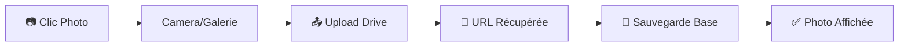
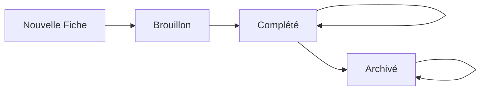

# 📊 SUPABASE_INTEGRATION_SPEC.md

## 🎯 Vue d'Ensemble

Ce document définit l'architecture complète pour l'intégration Supabase dans l'application Fiche Logement Letahost. Il couvre la structure database, les permissions, le workflow des statuts et la stratégie de sauvegarde.

---

## 📁 Gestion des Fichiers (Photos/Vidéos)

### 🎯 **Architecture : Google Drive + Supabase URLs**

**Stockage des fichiers :**
- **Photos/Vidéos** → Google Drive Workspace Letahost (120 To disponibles)
- **URLs publiques** → Base Supabase (références uniquement)

**Avantages :**
- Coût zéro stockage (vs Supabase Storage payant)
- Gestion centralisée dans l'écosystème Google existant
- Facilité de partage et backup
- Espace quasi-illimité

### 📱 **Workflow UX Target**



**Expérience coordinateur :**
1. Clic bouton "📷 Ajouter photo" dans formulaire
2. Camera s'ouvre
3. Photo prise → Upload automatique vers Drive
4. URL Drive récupérée et sauvegardée en base
5. Photo s'affiche immédiatement dans l'interface

### 🔧 **Implémentation Technique**

#### Structure Données
```javascript
// Dans les sections JSONB Supabase
{
  "section_clefs": {
    "interphonePhoto": {
      "drive_url": "https://drive.google.com/file/d/ABC123/view",
      "drive_file_id": "ABC123",
      "file_name": "interphone_logement_45.jpg"
    },
    "clefs": {
      "photos": [
        {
          "drive_url": "https://drive.google.com/file/d/DEF456/view",
          "drive_file_id": "DEF456", 
          "file_name": "clefs_entree.jpg"
        },
        {
          "drive_url": "https://drive.google.com/file/d/GHI789/view",
          "drive_file_id": "GHI789",
          "file_name": "clefs_boite.jpg"
        }
      ]
    }
  }
}
```

#### Google Drive API Setup
```javascript
// Configuration Google Drive API
const DRIVE_CONFIG = {
  folder_id: 'FOLDER_ID_FICHES_LOGEMENT',  // Dossier dédié Drive
  permissions: 'anyone_with_link',          // URLs publiques
  organization: 'letahost_workspace'        // Workspace Letahost
}

// Helper upload vers Drive
const uploadToDrive = async (file, section, ficheId) => {
  // 1. Upload fichier vers Drive API
  // 2. Définir permissions publiques  
  // 3. Récupérer URL partageable
  // 4. Retourner { drive_file_id, drive_url, file_name }
}
```

### 📁 **Organisation Drive**

**Structure dossiers proposée :**
```
📁 Fiches Logement Letahost/
├── 📁 2025/
│   ├── 📁 Juin/
│   │   ├── 📁 Fiche_001_Appartement_Paris/
│   │   │   ├── 🖼️ proprietaire_documents.pdf
│   │   │   ├── 🖼️ clefs_entree.jpg
│   │   │   ├── 🖼️ cuisine_equipements.jpg
│   │   │   └── 🎥 visite_globale.mp4
│   │   └── 📁 Fiche_002_Maison_Lyon/
│   └── 📁 Juillet/
└── 📁 Archives/
```

### ⚙️ **Configuration Requise**

#### Google Cloud Console
- [ ] Projet Google Cloud créé
- [ ] Drive API activée
- [ ] Credentials OAuth2 configurés
- [ ] Service Account avec permissions Drive

#### Permissions Google Workspace
- [ ] Accès admin Google Workspace Letahost
- [ ] Dossier "Fiches Logement" créé avec permissions
- [ ] API autorisée au niveau organisation

#### Variables Environnement
```env
# Google Drive Configuration
GOOGLE_DRIVE_CLIENT_ID=xxx.apps.googleusercontent.com
GOOGLE_DRIVE_CLIENT_SECRET=xxx
GOOGLE_DRIVE_FOLDER_ID=1ABC_def_folder_id
GOOGLE_DRIVE_SERVICE_ACCOUNT_KEY=path/to/service-account.json
```

---

## 🗃 Architecture Database

### 📋 **Option Retenue : Master Table Unique**

**Justification :**
- Compatible avec le FormContext existant (`section_proprietaire`, `section_logement`, etc.)
- Simplicité opérationnelle pour <10 coordinateurs
- Une seule requête pour charger/sauvegarder une fiche complète
- PostgreSQL gère très bien les colonnes JSONB avec indexation

### 🏗 **Structure Tables**

#### Table Principale : `fiches`
```sql
CREATE TABLE fiches (
  -- Métadonnées
  id UUID DEFAULT gen_random_uuid() PRIMARY KEY,
  user_id UUID REFERENCES auth.users(id),
  nom TEXT NOT NULL DEFAULT 'Nouvelle fiche',
  statut TEXT DEFAULT 'Brouillon' CHECK (statut IN ('Brouillon', 'Complété', 'Archivé')),
  created_at TIMESTAMP WITH TIME ZONE DEFAULT NOW(),
  updated_at TIMESTAMP WITH TIME ZONE DEFAULT NOW(),
  
  -- Sections (JSONB pour flexibilité)
  section_proprietaire JSONB DEFAULT '{}',
  section_logement JSONB DEFAULT '{}',
  section_clefs JSONB DEFAULT '{}',
  section_airbnb JSONB DEFAULT '{}',
  section_booking JSONB DEFAULT '{}',
  section_reglementation JSONB DEFAULT '{}',
  section_exigences JSONB DEFAULT '{}',
  section_avis JSONB DEFAULT '{}',
  section_gestion_linge JSONB DEFAULT '{}',
  section_equipements JSONB DEFAULT '{}',
  section_consommables JSONB DEFAULT '{}',
  section_visite JSONB DEFAULT '{}',
  section_chambres JSONB DEFAULT '{}',
  section_salle_de_bains JSONB DEFAULT '{}',
  section_cuisine_1 JSONB DEFAULT '{}',
  section_cuisine_2 JSONB DEFAULT '{}',
  section_salon_sam JSONB DEFAULT '{}',
  section_equip_spe_exterieur JSONB DEFAULT '{}',
  section_communs JSONB DEFAULT '{}',
  section_teletravail JSONB DEFAULT '{}',
  section_bebe JSONB DEFAULT '{}',
  section_securite JSONB DEFAULT '{}'
);
```

#### Table Profiles : `profiles`
```sql
CREATE TABLE profiles (
  id UUID REFERENCES auth.users(id) PRIMARY KEY,
  role TEXT DEFAULT 'coordinateur' CHECK (role IN ('coordinateur', 'admin', 'super_admin')),
  prenom TEXT,
  nom TEXT,
  email TEXT,
  created_at TIMESTAMP WITH TIME ZONE DEFAULT NOW(),
  updated_at TIMESTAMP WITH TIME ZONE DEFAULT NOW()
);
```

#### Tables Annexes (Optionnelles - Phase 2)
```sql
-- Pour les uploads de fichiers/photos vers Google Drive
CREATE TABLE fiche_photos (
  id UUID DEFAULT gen_random_uuid() PRIMARY KEY,
  fiche_id UUID REFERENCES fiches(id) ON DELETE CASCADE,
  section_name TEXT NOT NULL,
  drive_file_id TEXT NOT NULL,      -- ID du fichier dans Google Drive
  drive_public_url TEXT NOT NULL,   -- URL publique partageable
  file_name TEXT,
  file_type TEXT CHECK (file_type IN ('image', 'video')),
  file_size INTEGER,
  created_at TIMESTAMP WITH TIME ZONE DEFAULT NOW()
);
```

---

## 👥 Système de Permissions

### 🔐 **3 Rôles Définis**

| Rôle | Permissions | Description |
|------|-------------|-------------|
| **`coordinateur`** | CRUD ses fiches uniquement | Utilisateurs terrain, accès mobile |
| **`admin`** | Lecture toutes les fiches | Accès consultation uniquement |
| **`super_admin`** | CRUD toutes les fiches + gestion utilisateurs | Julien + 2-3 personnes clés |

### 🛡 **Row Level Security (RLS)**

```sql
-- Activer RLS sur la table fiches
ALTER TABLE fiches ENABLE ROW LEVEL SECURITY;

-- Fonction helper pour récupérer le rôle utilisateur
CREATE OR REPLACE FUNCTION get_user_role()
RETURNS TEXT AS $$
BEGIN
  RETURN (SELECT role FROM profiles WHERE id = auth.uid());
END;
$$ LANGUAGE plpgsql SECURITY DEFINER;

-- Policy : Coordinateurs voient leurs propres fiches
CREATE POLICY "coordinateur_own_fiches" ON fiches
  FOR ALL USING (
    auth.uid() = user_id AND 
    get_user_role() = 'coordinateur'
  );

-- Policy : Admins voient toutes les fiches (lecture seule)
CREATE POLICY "admin_read_all_fiches" ON fiches
  FOR SELECT USING (get_user_role() IN ('admin', 'super_admin'));

-- Policy : Super admins peuvent tout faire
CREATE POLICY "super_admin_all_fiches" ON fiches
  FOR ALL USING (get_user_role() = 'super_admin');
```

### 👤 **Gestion des Comptes**

**Création de comptes :**
- Super admins uniquement (interface dédiée)
- Invitation par email avec rôle pré-défini
- Auto-création du profil lors de la première connexion

---

## 📋 Workflow des Statuts

### 🔄 **Cycle de Vie des Fiches**



### 📊 **3 Statuts Définis**

| Statut | Déclencheur | Couleur | Comportement |
|--------|-------------|---------|--------------|
| **`Brouillon`** | Création fiche | Orange/Jaune | En cours de remplissage |
| **`Complété`** | Bouton "Finaliser" page 22 | Vert | Fiche terminée mais modifiable |
| **`Archivé`** | Action manuelle Dashboard | Gris | Fiche inactive |

### 🎯 **Transitions**

**Automatiques :**
- Nouvelle fiche → `Brouillon` (immédiat)
- Bouton "Finaliser la fiche" (page 22/22) → `Complété`
- Modification d'une fiche `Complété` → Reste `Complété`

**Manuelles :**
- Bouton "Archiver" dans Dashboard → `Archivé`
- Super admin peut changer n'importe quel statut

### 🗂 **Affichage Dashboard**

**Vue par défaut :** Fiches `Brouillon` + `Complété`
**Onglet "Archivé" :** Fiches `Archivé` uniquement

---

## 💾 Stratégie de Sauvegarde

### ✅ **Système Actuel Conservé**

**Sauvegarde manuelle :**
- Bouton "Enregistrer" sur chaque page
- Fonction `handleSave()` dans FormContext
- États visuels : Sauvegarde/Succès/Erreur

**Persistance locale :**
- FormContext maintient les données en mémoire
- Navigation entre sections sans perte
- `updateField()` et `updateSection()` temps réel

### 🚫 **Décisions d'Architecture**

**Pas d'auto-save :**
- Contrôle utilisateur sur la sauvegarde
- Évite les conflits réseau sur mobile
- Performance préservée

**Pas d'historique versions :**
- Simplicité de la base de données
- Une seule version "current" par fiche
- Évolutif (ajout possible phase 2)

**Gestion conflits simplifiée :**
- 1 coordinateur = 1 fiche (pas de partage)
- Super admins : modification exceptionnelle

---

## 🔧 Implémentation Technique

### 📁 **Fichiers à Modifier/Créer**

```
src/
├── lib/
│   ├── supabaseClient.js          # Configuration Supabase
│   ├── supabaseHelpers.js         # CRUD helpers (existant à étendre)
│   ├── authHelpers.js             # Gestion auth + rôles (nouveau)
│   ├── googleDriveClient.js       # Configuration Google Drive API (nouveau)
│   └── fileUploadHelpers.js       # Upload Drive + URLs (nouveau)
├── components/
│   ├── FormContext.jsx            # Intégrer sauvegarde Supabase (existant)
│   ├── ProtectedRoute.jsx         # Routes protégées par rôle (nouveau)
│   ├── PhotoUpload.jsx            # Composant upload photos (nouveau)
│   └── FilePreview.jsx            # Affichage photos/vidéos (nouveau)
├── pages/
│   ├── Dashboard.jsx              # Liste fiches + statuts (existant à modifier)
│   ├── Login.jsx                  # Auth Supabase (existant)
│   └── AdminPanel.jsx             # Gestion utilisateurs (nouveau)
└── hooks/
    ├── useAuth.js                 # Hook auth + rôles (nouveau)
    ├── useFiches.js               # Hook CRUD fiches (nouveau)
    └── useFileUpload.js           # Hook upload Drive (nouveau)
```

### 🔗 **API FormContext Extended**

```javascript
// Nouvelles fonctions à ajouter
const {
  // ... fonctions existantes
  
  // Supabase operations
  handleSave,           // Sauvegarder en base
  handleLoad,           // Charger depuis base
  saveStatus,           // État sauvegarde
  
  // Statut management
  updateStatut,         // Changer statut fiche
  finaliserFiche,       // Marquer comme Complété
  archiverFiche,        // Marquer comme Archivé
  
} = useForm()
```

### 📊 **Queries Supabase Types**

```javascript
// Dashboard - Fiches par utilisateur
const getFichesByUser = (userId, includeArchived = false) => {
  let query = supabase
    .from('fiches')
    .select('id, nom, statut, updated_at')
    .eq('user_id', userId)
    
  if (!includeArchived) {
    query = query.neq('statut', 'Archivé')
  }
  
  return query.order('updated_at', { ascending: false })
}

// Admin - Toutes les fiches
const getAllFiches = (includeArchived = false) => {
  let query = supabase
    .from('fiches')
    .select('*, profiles(prenom, nom)')
    
  if (!includeArchived) {
    query = query.neq('statut', 'Archivé')
  }
  
  return query.order('updated_at', { ascending: false })
}
```

---

## 🚀 Plan de Déploiement

### 📝 **Phase 1 : Setup Base**
1. ✅ Créer tables Supabase + RLS
2. ✅ Configurer authentification
3. ✅ Adapter FormContext pour Supabase
4. ✅ Setup Google Drive API + credentials
5. ✅ Tester CRUD basique + upload photos

### 📝 **Phase 2 : Dashboard + Workflow**
1. ✅ Dashboard avec liste fiches + statuts
2. ✅ Bouton "Finaliser" page 22
3. ✅ Actions Archiver/Désarchiver
4. ✅ Filtres par statut
5. ✅ Composants PhotoUpload intégrés formulaires

### 📝 **Phase 3 : Permissions + Admin**
1. ✅ Panel admin pour gestion utilisateurs
2. ✅ Routes protégées par rôles
3. ✅ Gestion permissions Drive par utilisateur
4. ✅ Tests complets workflow permissions

### 📝 **Phase 4 : Polish + Tests**
1. ✅ Gestion erreurs réseau + upload
2. ✅ Tests mobile complets (camera + galerie)
3. ✅ Performance optimizations (compression images)
4. ✅ Documentation utilisateur

---

## ⚠️ Considérations Techniques

### 🔒 **Sécurité**
- RLS activé sur toutes les tables sensibles
- Validation côté serveur des rôles
- Tokens JWT sécurisés
- HTTPS obligatoire en production

### 📱 **Performance Mobile**
- Requêtes optimisées (SELECT uniquement les colonnes nécessaires)
- Pagination sur les listes de fiches
- Cache local pour navigation offline
- Compression automatique des images avant upload Drive
- Retry automatique en cas d'échec upload
- Indicateurs de progression upload

### 🌐 **Déploiement**
- Variables d'environnement pour Supabase
- Migrations DB versionnées
- Tests automatisés sur les permissions
- Monitoring erreurs production

---

## 📋 Checklist de Validation

### ✅ **Tests Fonctionnels**
- [ ] Coordinateur peut créer/modifier ses fiches uniquement
- [ ] Admin peut voir toutes les fiches (lecture seule)
- [ ] Super admin peut tout gérer + créer comptes
- [ ] Workflow statuts fonctionne (Brouillon → Complété → Archivé)
- [ ] Sauvegarde/chargement fiches sans perte données
- [ ] Dashboard affiche correctement par rôle
- [ ] Upload photos/vidéos vers Drive fonctionnel
- [ ] URLs Drive accessibles et sécurisées
- [ ] Mobile : camera + galerie + upload seamless
- [ ] Compression images automatique
- [ ] Gestion erreurs upload (réseau, permissions, etc.)

### ✅ **Tests Techniques**
- [ ] RLS bloque l'accès non autorisé
- [ ] Performance acceptable sur mobile 3G
- [ ] Gestion erreurs réseau gracieuse
- [ ] Pas de fuite mémoire navigation longue
- [ ] Backup/restore base données
- [ ] Google Drive API rate limits respectées
- [ ] Permissions Drive correctement configurées
- [ ] Sécurité upload (types fichiers, taille max)
- [ ] Cleanup fichiers Drive orphelins

---

**📅 Dernière mise à jour :** Juin 2025  
**👤 Responsable :** Julien  
**🔄 Version :** 1.0