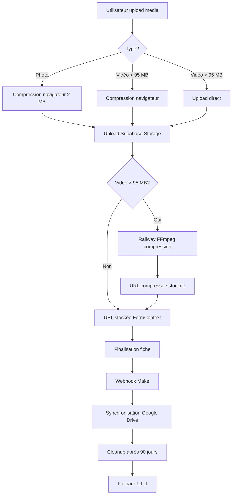

# 📸 SYSTÈME D'UPLOAD PHOTOS & VIDÉOS - Documentation Complète
*Mise à jour : 12 février 2026*

---

## 🎯 **VUE D'ENSEMBLE**

Système complet d'upload, compression, et gestion du cycle de vie des médias (photos/vidéos) pour l'application Fiche Logement.

### **Fonctionnalités principales**
- ✅ Upload photos/vidéos vers Supabase Storage
- ✅ Compression automatique (photos 2 MB, vidéos 95-350 MB)
- ✅ Cleanup automatique après 90 jours (Edge Function + Cron)
- ✅ Fallback UI pour médias archivés
- ✅ Synchronisation Google Drive via Make.com
- ✅ Validation numéro de bien obligatoire

---

## 🏗️ **ARCHITECTURE GÉNÉRALE**

### **Workflow Complet : Upload → Compression → Storage → Drive → Cleanup**


```mermaid
graph TD
    A[Utilisateur upload média] --> B{Type?}
    B -->|Photo| C[Compression navigateur 2 MB]
    B -->|Vidéo < 95 MB| D[Compression navigateur]
    B -->|Vidéo > 95 MB| E[Upload direct]
    
    C --> F[Upload Supabase Storage]
    D --> F
    E --> F
    
    F --> G{Vidéo > 95 MB?}
    G -->|Oui| H[Railway FFmpeg compression]
    G -->|Non| I[URL stockée FormContext]
    
    H --> J[URL compressée stockée]
    J --> I
    
    I --> K[Finalisation fiche]
    K --> L[Webhook Make]
    L --> M[Synchronisation Google Drive]
    
    M --> N[Cleanup après 90 jours]
    N --> O[Fallback UI 📁]
```

---

## 📦 **1. COMPOSANT PHOTOUPLOAD.JSX**

### **Architecture du composant**

**Fichier** : [`src/components/PhotoUpload.jsx`](file:///c:/dev-projects/fiche-logement_ia-githubcopilot-v1/src/components/PhotoUpload.jsx)

**Props** :
```javascript
<PhotoUpload
  fieldPath="section_equipements.poubelle_photos"  // Path FormContext
  label="Photos du local poubelle"                 // Label affiché
  multiple={true}                                   // Plusieurs fichiers
  maxFiles={10}                                     // Limite nombre
  capture={false}                                   // Capture mobile
  acceptVideo={false}                               // Autoriser vidéos
/>
```

**États internes** :
- `uploading` : Upload en cours
- `compressing` : Compression navigateur en cours
- `backendCompressing` : Compression Railway en cours
- `error` : Message d'erreur

---

## 🗜️ **2. COMPRESSION AUTOMATIQUE**

### **2.1 Compression Photos (Client-side)**

**Librairie** : `browser-image-compression`  
**Cible** : 2 MB maximum  
**Résultat observé** : 2.8 MB → 1.6 MB

```javascript
// PhotoUpload.jsx - lignes 244-259
if (isImage) {
  const options = {
    maxSizeMB: 2,
    useWebWorker: true
  }
  fileToUpload = await imageCompression(file, options)
  console.log(`📷 Compression: ${(file.size / 1024 / 1024).toFixed(1)}MB → ${(fileToUpload.size / 1024 / 1024).toFixed(1)}MB`)
}
```

**Avantages** :
- ✅ Compression instantanée côté client
- ✅ Réduit la bande passante upload
- ✅ Web Worker (pas de blocage UI)
- ✅ Limite storage Supabase

---

### **2.2 Compression Vidéos (Système à deux niveaux)**

#### **Niveau 1 : Compression Navigateur (< 95 MB)**

**Technologie** : Canvas + MediaRecorder + Web Audio API  
**Résolution cible** : 1600px max  
**Bitrate vidéo** : 4 Mbps  
**Bitrate audio** : 128 kbps  
**Codec** : VP8 (vidéo) + Opus (audio)

```javascript
// PhotoUpload.jsx - lignes 67-222
const compressVideo = async (file) => {
  // Seuil : pas de compression si < 95 MB
  if (file.size <= 95 * 1024 * 1024) {
    return file
  }
  
  // Compression avec audio préservé
  const mediaRecorder = new MediaRecorder(combinedStream, {
    mimeType: 'video/webm;codecs=vp8,opus',
    videoBitsPerSecond: 4000000,  // 4 Mbps
    audioBitsPerSecond: 128000    // 128 kbps
  })
  
  // Rendu frame par frame (30 FPS)
  // ...
}
```

**Fonctionnement** :
1. Charger vidéo dans élément `<video>`
2. Extraire audio via `AudioContext.decodeAudioData()`
3. Redimensionner frames via `<canvas>` (1600px max)
4. Combiner audio + vidéo dans `MediaStream`
5. Enregistrer avec `MediaRecorder`
6. Générer fichier `.webm` compressé

**Feedback utilisateur** :
```javascript
// État "compressing" activé pendant le traitement
setCompressing(true)

// Message affiché :
"⏳ Compression en cours... Merci de patienter, ne fermez pas cette page"
```

---

#### **Niveau 2 : Compression Backend Railway (> 95 MB)**

**Service** : `https://video-compressor-production.up.railway.app`  
**Technologie** : FFmpeg (Node.js)  
**Résolution cible** : 1280p (720p)  
**Bitrate vidéo** : 2 Mbps  
**Bitrate audio** : 128 kbps  
**Codec** : H.264 (libx264) + AAC

**Workflow** :
1. **Upload initial** : Vidéo uploadée sur Supabase Storage (non compressée)
2. **Appel Railway** : Frontend envoie URL publique au backend
3. **Compression FFmpeg** : Backend télécharge, compresse, et re-upload
4. **URL compressée** : Frontend stocke l'URL compressée dans FormContext

```javascript
// PhotoUpload.jsx - lignes 296-329
if (isVideo && file.size > 95 * 1024 * 1024) {
  console.log('🎬 Vidéo > 95MB, compression backend en cours...')
  setBackendCompressing(true)
  
  const response = await fetch('https://video-compressor-production.up.railway.app/compress-video', {
    method: 'POST',
    headers: { 'Content-Type': 'application/json' },
    body: JSON.stringify({ videoUrl: urlData.publicUrl })
  })
  
  const result = await response.json()
  uploadedUrls.push(result.compressedUrl) // URL compressée
}
```

**Backend FFmpeg (compressVideo.js)** :
```javascript
// Railway : video-compressor project
ffmpeg(inputPath)
  .videoCodec('libx264')
  .size('1280x?')              // 720p
  .videoBitrate('2000k')       // 2 Mbps
  .audioCodec('aac')
  .audioBitrate('128k')        // 128 kbps
  .outputOptions([
    '-preset fast',            // Compromis vitesse/qualité
    '-crf 28'                  // Qualité correcte
  ])
  .save(outputPath)
```

**Fonctionnement** :
1. Téléchargement streaming (optimisé RAM)
2. Compression FFmpeg avec paramètres optimisés
3. Upload vers Supabase Storage (`_compressed.mp4`)
4. Retour URL publique compressée
5. Nettoyage fichiers temporaires

**Feedback utilisateur** :
```javascript
// État "backendCompressing" activé
setBackendCompressing(true)

// Message affiché :
"⏳ Votre vidéo est compressée, cela peut prendre quelques minutes."
```

---

### **2.3 Tableau Récapitulatif Compression**

| Type | Taille | Méthode | Technologie | Résolution | Bitrate | Temps |
|------|--------|---------|-------------|------------|---------|-------|
| **Photo** | Toutes | Client | browser-image-compression | Originale | - | < 1s |
| **Vidéo** | < 95 MB | Aucune | - | Originale | - | 0s |
| **Vidéo** | 95-350 MB | Client | Canvas + MediaRecorder | 1600px | 4 Mbps | 30s-2min |
| **Vidéo** | > 95 MB | Backend | FFmpeg (Railway) | 1280p | 2 Mbps | 2-5min |

**Limites après compression** :
- Photos : 20 MB max
- Vidéos : 350 MB max

---

## 💾 **3. STORAGE SUPABASE**

### **Structure des buckets**

```
📁 fiche-photos (PUBLIC)
└── user-{user_id}/
    └── fiche-{numero_bien}/
        └── {section}/
            └── {field}/
                ├── timestamp_randomId_photo.jpg
                ├── timestamp_randomId_video.mp4
                └── timestamp_randomId_video_compressed.mp4
```

**Exemple concret** :
```
user-fb6faa31-a18a-46bf-aec8-46e3bfc7ff17/
  fiche-1137/
    section_clefs/
      clefs/
        1752111595319_qn38vf_clefs_entree.jpg
    section_equipements/
      poubelle_photos/
        1752111623456_abc123_poubelle.jpg
    section_visite/
      video_visite/
        1752111650789_def456_visite.mp4
        1752111650789_def456_visite_compressed.mp4  ← Vidéo > 95 MB
```

**Naming convention** :
```javascript
const generateStoragePath = (fileName) => {
  const timestamp = Date.now()
  const randomId = Math.random().toString(36).substr(2, 6)
  const cleanFileName = sanitizeFileName(fileName)
  
  return `user-${user.id}/fiche-${numeroBien}/${section}/${field}/${timestamp}_${randomId}_${cleanFileName}`
}
```

**Sanitization** :
- Suppression accents (é → e)
- Remplacement espaces par `_`
- Suppression caractères spéciaux
- Évite underscores multiples

---

## 🧹 **4. SYSTÈME DE CLEANUP AUTOMATIQUE**

### **Politique de rétention**

| Type | Rétention | Raison |
|------|-----------|--------|
| **Photos** | 90 jours | Synchronisées sur Drive dès finalisation |
| **Vidéos** | 90 jours | Synchronisées sur Drive dès finalisation |
| **PDFs** | 7 jours | Régénérables à tout moment |

**Contexte** : Le storage avait atteint **107 GB** (limite 100 GB), bloquant tous les uploads.

---

### **Architecture du cleanup**

#### **1. Fonction SQL : `get_old_storage_objects`**

```sql
CREATE OR REPLACE FUNCTION public.get_old_storage_objects(
  p_bucket_id TEXT,
  p_cutoff TIMESTAMPTZ,
  p_limit INT DEFAULT 1000
)
RETURNS TABLE(name TEXT, size BIGINT)
LANGUAGE SQL
SECURITY DEFINER
AS $$
  SELECT name, (metadata->>'size')::bigint as size
  FROM storage.objects
  WHERE bucket_id = p_bucket_id
  AND created_at < p_cutoff
  AND name NOT LIKE 'assets/%'  -- Protège le logo PDF
  ORDER BY created_at ASC
  LIMIT p_limit;
$$;
```

**Raison d'existence** : `storage.objects` n'est pas accessible via l'API REST Supabase (erreur PGRST106). C'est le **seul moyen** d'accéder à ces données depuis une Edge Function.

---

#### **2. Edge Function : `cleanup-storage`**

**Déploiement** : `supabase/functions/cleanup-storage/index.ts`

**Paramètres** :
```typescript
const DRY_RUN = false           // true = test sans suppression
const CUTOFF_DAYS_PHOTOS = 90   // 3 mois
const CUTOFF_DAYS_PDFS = 7      // 1 semaine
const BATCH_SIZE = 1000         // Limite Supabase .remove()
```

**Workflow** :
1. Calcul date cutoff (`NOW() - 90 days`)
2. Appel `.rpc('get_old_storage_objects')` pour chaque bucket
3. Suppression par batch de 1000 fichiers via `.remove()`
4. Logs détaillés (fichiers supprimés, espace libéré)

```typescript
// Récupération fichiers anciens
const { data: oldFiles } = await supabase.rpc('get_old_storage_objects', {
  p_bucket_id: 'fiche-photos',
  p_cutoff: cutoffDate,
  p_limit: 1000
})

// Suppression via API (JAMAIS via SQL DELETE)
if (!DRY_RUN) {
  await supabase.storage.from('fiche-photos').remove(filePaths)
}
```

> [!CAUTION]
> **Ne JAMAIS faire `DELETE FROM storage.objects`**
> 
> Le trigger `protect_delete` interdit les suppressions SQL directes. Toujours utiliser l'API `.remove()` pour éviter les fichiers orphelins.

---

#### **3. Cron Job : `cleanup-storage-daily`**

**Schedule** : Tous les jours à 2h du matin (`0 2 * * *`)

```sql
-- Configuration dans Supabase Dashboard > Database > Cron Jobs
SELECT cron.schedule(
  'cleanup-storage-daily',
  '0 2 * * *',
  $$
  SELECT net.http_post(
    url := 'https://[PROJECT_REF].supabase.co/functions/v1/cleanup-storage',
    headers := jsonb_build_object(
      'Content-Type', 'application/json',
      'Authorization', 'Bearer [ANON_KEY]'
    )
  );
  $$
);
```

**Vérification** :
```sql
SELECT jobname, schedule, active FROM cron.job;
```

---

### **Monitoring du storage**

**Source de vérité** (dashboard peut avoir 1h de retard) :
```sql
SELECT
  bucket_id,
  (sum((metadata->>'size')::bigint) / 1024.0 / 1024.0 / 1024.0)::numeric(10,2) as total_gb
FROM storage.objects
GROUP BY bucket_id
ORDER BY total_gb DESC;
```

**Résultat attendu** :
```
bucket_id      | total_gb
---------------|----------
fiche-photos   | 45.23
fiche-pdfs     | 2.15
guide-acces-pdfs | 0.87
annonce-pdfs   | 0.34
```

**Vérifier fichiers > 90 jours restants** :
```sql
SELECT COUNT(*),
  (sum((metadata->>'size')::bigint) / 1024.0 / 1024.0 / 1024.0)::numeric(10,2) as total_gb
FROM storage.objects
WHERE bucket_id = 'fiche-photos'
AND created_at < NOW() - INTERVAL '90 days';
```

---

### **Résultats du cleanup**

| Métrique | Avant | Après |
|----------|-------|-------|
| Storage total | 107 GB | 93 GB |
| Fichiers supprimés | - | 2 533 |
| Espace libéré | - | ~14 GB |
| Taille moyenne photo | 5.5 MB | ~2 MB (compression) |

---

## 📁 **5. FALLBACK UI - PHOTOS ARCHIVÉES**

### **Problème**

Après 90 jours, les photos sont supprimées du storage Supabase mais les URLs restent dans la base de données. Résultat : erreurs 404 lors de l'affichage.

---

### **Solution : Composant PhotoWithFallback**

**Fichier** : [`PhotoUpload.jsx`](file:///c:/dev-projects/fiche-logement_ia-githubcopilot-v1/src/components/PhotoUpload.jsx) (lignes 429-450)

```javascript
const PhotoWithFallback = ({ photoUrl, index }) => {
  const [broken, setBroken] = useState(false)

  if (broken) {
    return (
      <div className="w-full h-24 rounded-lg border bg-gray-50 flex flex-col items-center justify-center gap-1">
        <span className="text-lg">📁</span>
        <span className="text-xs text-gray-400">Archivée sur Drive</span>
      </div>
    )
  }

  return (
     setBroken(true)}  // Détection 404
    />
  )
}
```

**Fonctionnement** :
1. Tentative de chargement de l'image
2. Si erreur 404 → `onError` déclenché
3. État `broken` passe à `true`
4. Affichage du placeholder "📁 Archivée sur Drive"

**Avantages** :
- ✅ Pas de console errors
- ✅ UX gracieuse (pas d'image cassée)
- ✅ Information claire pour l'utilisateur
- ✅ Rappel que les photos sont sur Drive

---

### **Message d'avertissement utilisateur**

**Fichier** : [`PhotoUpload.jsx`](file:///c:/dev-projects/fiche-logement_ia-githubcopilot-v1/src/components/PhotoUpload.jsx) (lignes 542-552)

```javascript
{currentPhotos.length > 0 && (
  <div className="text-xs text-orange-600 bg-orange-50 border border-orange-200 p-2 rounded mt-2">
    <svg className="w-4 h-4 mt-0.5 flex-shrink-0" fill="currentColor" viewBox="0 0 20 20">
      <path fillRule="evenodd" d="M8.257 3.099c.765-1.36 2.722-1.36 3.486 0l5.58 9.92..." />
    </svg>
    <span>
      <strong>Photos conservées 90 jours</strong> dans l'application.
      Elles seront ensuite disponibles uniquement dans Google Drive.
    </span>
  </div>
)}
```

**Affichage** : Dès qu'au moins 1 photo est uploadée

---

## 🔄 **6. SYNCHRONISATION GOOGLE DRIVE**

### **Trigger Supabase**

**Déclenchement** : Statut passe à "Complété"  
**Webhook** : `https://hook.eu2.make.com/ydjwftmd7czs4rygv1rjhi6u4pvb4gdj`

**Payload** : 94 champs média structurés (voir détails dans [`docs/📊 SUPABASE SPEC.md`](file:///c:/dev-projects/fiche-logement_ia-githubcopilot-v1/docs/%F0%9F%93%8A%20SUPABASE%20SPEC.md))

```sql
-- Fonction : notify_fiche_completed()
-- Trigger : fiche_any_update_webhook
-- Condition : statut = 'Complété' AND OLD.statut IS DISTINCT FROM 'Complété'

CREATE OR REPLACE FUNCTION public.notify_fiche_completed()
RETURNS trigger AS $function$
BEGIN
  IF NEW.statut = 'Complété' AND OLD.statut IS DISTINCT FROM 'Complété' THEN
    PERFORM net.http_post(
      url := 'https://hook.eu2.make.com/ydjwftmd7czs4rygv1rjhi6u4pvb4gdj',
      body := jsonb_build_object(
        'id', NEW.id,
        'media', jsonb_build_object(
          'clefs_photos', NEW.clefs_photos,
          'equipements_poubelle_photos', NEW.equipements_poubelle_photos,
          -- ... 92 autres champs média
        )
      ),
      headers := '{"Content-Type": "application/json"}'::jsonb
    );
  END IF;
  RETURN NEW;
END;
$function$;
```

---

### **Workflow Make.com**

**Modules** :
1. **Webhook** → Réception payload
2. **Filter** → Statut = "Complété" (sécurité)
3. **HTTP GET** → Téléchargement de chaque photo/vidéo
4. **Google Drive Create Folder** → Arborescence automatique
5. **Google Drive Upload** → Organisation finale

**Structure Drive** :
```
📁 2. DOSSIERS PROPRIETAIRES/
├── 📁 5566. Florence TEISSIER - Saint Pons/
│   ├── 📁 3. INFORMATIONS LOGEMENT/
│   │   ├── 📁 2. Photos Visite Logement/
│   │   │   ├── chambres/
│   │   │   ├── salles_de_bains/
│   │   │   └── salon/
│   │   ├── 📁 3. Accès au logement/
│   │   │   ├── Photos d'accès/
│   │   │   └── Vidéos d'accès/
│   │   ├── 📁 4. Tour générale du logement/
│   │   └── 📁 5. Équipements/
│   │       ├── Équipement/
│   │       └── Tuto/
```

**Mapping photos → dossiers** : Voir détails complets dans section "MAPPING LOGIQUE PHOTOS → DOSSIERS DRIVE" ci-dessous.

---

## 📊 **7. MAPPING PHOTOS → DOSSIERS DRIVE**

### **94 Champs Média Total**

#### **📁 2. Photos Visite Logement (16 champs)**
- `chambres_chambre_1_photos` → `chambres_chambre_6_photos`
- `salle_de_bain_1_photos` → `salle_de_bain_6_photos`
- `salon_sam_photos`
- `cuisine2_photos_tiroirs_placards`
- `exterieur_photos_espaces`
- `communs_photos_espaces`

#### **📁 3. Accès au logement (2 champs)**
- **Photos guide d'accès** : `guide_acces_photos_etapes`
- **Vidéo guide d'accès** : `guide_acces_video_acces`

#### **📁 4. Tour générale du logement (1 champ)**
- `visite_video_visite`

#### **📁 5. Équipements (38 champs)**

**Sous-dossier "Équipement"** :
- Clefs (5) : `clefs_emplacement_photo`, `clefs_interphone_photo`, `clefs_tempo_gache_photo`, `clefs_digicode_photo`, `clefs_photos`
- Équipements (8) : `equipements_poubelle_photos`, `equipements_disjoncteur_photos`, `equipements_vanne_eau_photos`, `equipements_chauffage_eau_photos`, `equipements_wifi_routeur_photo`, `equipements_parking_photos`, `equipements_ventilateur_photos`, `equipements_seche_serviettes_photos`
- Cuisine photos (6) : `cuisine1_cuisiniere_photo`, `cuisine1_plaque_cuisson_photo`, `cuisine1_four_photo`, `cuisine1_micro_ondes_photo`, `cuisine1_lave_vaisselle_photo`, `cuisine1_cafetiere_photo`
- Linge (2) : `linge_photos_linge`, `linge_emplacement_photos`
- Extérieur (2) : `jacuzzi_photos_jacuzzi`, `barbecue_photos`
- Autres (3) : `bebe_photos_equipements`, `securite_photos_equipements`, `equipements_menage_*_photos`

**Sous-dossier "Tuto"** (17 vidéos) :
- Cuisine : `refrigerateur_video`, `congelateur_video`, `mini_refrigerateur_video`, `cuisiniere_video`, `plaque_cuisson_video`, `four_video`, `micro_ondes_video`, `lave_vaisselle_video`, `cafetiere_video`, `bouilloire_video`, `grille_pain_video`, `blender_video`, `cuiseur_riz_video`, `machine_pain_video`, `hotte_video`
- Équipements : `video_acces_poubelle`, `video_systeme_chauffage`, `piscine_video`, `tv_video`, `climatisation_video`, `chauffage_video`, `lave_linge_video`, `seche_linge_video`, `canape_lit_video`

#### **📁 Éléments abîmés (21 champs)**
- Avis (2) : `avis_video_globale_videos`, `avis_logement_vis_a_vis_photos`
- Cuisine (1) : `cuisine1_elements_abimes_photos`
- Salon/SAM (2) : `salon_sam_salon_elements_abimes_photos`, `salon_sam_salle_manger_elements_abimes_photos`
- Chambres (6) : `chambres_chambre_[1-6]_elements_abimes_photos`
- Salles de bains (6) : `salle_de_bains_salle_de_bain_[1-6]_elements_abimes_photos`
- Extérieur (3) : `equip_spe_ext_garage_elements_abimes_photos`, `equip_spe_ext_buanderie_elements_abimes_photos`, `equip_spe_ext_autres_pieces_elements_abimes_photos`

---

## 🗄️ **8. BASE DE DONNÉES**

### **Colonnes média (TEXT[])**

```sql
-- Exemples de colonnes photos/vidéos
clefs_photos TEXT[]
equipements_poubelle_photos TEXT[]
equipements_disjoncteur_photos TEXT[]
linge_photos_linge TEXT[]
linge_emplacement_photos TEXT[]
chambres_chambre_1_photos_chambre TEXT[]
salle_de_bains_salle_de_bain_1_photos_salle_de_bain TEXT[]
cuisine_1_refrigerateur_video TEXT[]
visite_video_visite TEXT[]
guide_acces_photos_etapes TEXT[]
guide_acces_video_acces TEXT[]
securite_photos_equipements_securite TEXT[]
-- ... 94 champs média au total
```

**Format stocké** :
```json
{
  "clefs_photos": [
    "https://qwjgkqxemnpvlhwxexht.supabase.co/storage/v1/object/public/fiche-photos/user-xxx/fiche-1137/section_clefs/clefs/1752111595319_qn38vf_clefs.jpg"
  ],
  "equipements_poubelle_photos": [
    "https://qwjgkqxemnpvlhwxexht.supabase.co/storage/v1/object/public/fiche-photos/user-xxx/fiche-1137/section_equipements/poubelle_photos/1752111623456_abc123_poubelle.jpg"
  ]
}
```

---

## ⚙️ **9. VALIDATION & GESTION ERREURS**

### **Validation numéro de bien obligatoire**

```javascript
// PhotoUpload.jsx - lignes 226-230
const uploadToSupabase = async (files) => {
  const numeroBien = getField('section_logement.numero_bien')
  if (!numeroBien || numeroBien.trim() === '') {
    throw new Error('Impossible d\'uploader : le numéro de bien est obligatoire. Remplissez ce champ dans la section "Logement" avant d\'ajouter des photos.')
  }
  // ...
}
```

**Raison** : Le path de stockage inclut le numéro de bien. Sans lui, impossible d'organiser les fichiers correctement.

---

### **Validation taille fichiers**

```javascript
// Limites APRÈS compression
const maxSize = isVideo ? 350 * 1024 * 1024 : 20 * 1024 * 1024

if (fileToUpload.size > maxSize) {
  const maxSizeMB = isVideo ? '350MB' : '20MB'
  throw new Error(`${file.name} est encore trop volumineux après compression (max ${maxSizeMB})`)
}
```

**Limites** :
- Photos : 20 MB max
- Vidéos : 350 MB max (après compression)

---

### **Gestion erreurs**

**Affichage** :
```javascript
{error && (
  <div className="mt-2 p-3 bg-red-50 border border-red-200 rounded text-red-700 text-sm">
    {error}
  </div>
)}
```

**Cas d'erreurs gérés** :
- ✅ Numéro de bien manquant
- ✅ Format fichier invalide
- ✅ Taille trop volumineuse
- ✅ Erreur upload Supabase
- ✅ Erreur compression backend
- ✅ Limite nombre de fichiers dépassée

**Fallback compression** :
```javascript
try {
  fileToUpload = await imageCompression(file, options)
} catch (error) {
  console.error('Erreur compression:', error)
  fileToUpload = file // Fallback vers fichier original
}
```

---

## 🎨 **10. INTERFACE UTILISATEUR**

### **Zone de drop**

```javascript
<div className="border-2 border-dashed border-gray-300 rounded-lg p-6 text-center hover:border-gray-400 transition-colors">
  <input
    type="file"
    accept={acceptVideo ? "image/*,video/*" : "image/*"}
    multiple={multiple}
    capture={capture ? "environment" : undefined}
    onChange={handleFileChange}
    disabled={uploading || compressing || backendCompressing}
    className="hidden"
    id={`upload-${fieldPath}`}
  />
  
  <label htmlFor={`upload-${fieldPath}`} className="cursor-pointer">
    {/* États : backendCompressing > compressing > uploading > normal */}
  </label>
</div>
```

**États visuels** :
1. **Normal** : "Ajouter des photos/vidéos" + icône +
2. **Uploading** : Spinner bleu + "Upload en cours..."
3. **Compressing** : Spinner orange + "Compression en cours... ⏳ Merci de patienter"
4. **BackendCompressing** : Spinner violet + "Compression en cours... ⏳ Votre vidéo est compressée, cela peut prendre quelques minutes."

---

### **Galerie photos existantes**

```javascript
<div className="grid grid-cols-2 sm:grid-cols-3 md:grid-cols-4 gap-4">
  {currentPhotos.map((photoUrl, index) => {
    const isVideo = /\.(mp4|webm|ogg|mov|avi)$/i.test(photoUrl)
    
    return (
      <div key={index} className="relative group">
        {isVideo ? (
          // Icône vidéo
          <div className="w-full h-24 bg-gray-800 rounded-lg">
            <svg>...</svg>
            <span>Vidéo</span>
          </div>
        ) : (
          // Image avec fallback
          <PhotoWithFallback photoUrl={photoUrl} index={index} />
        )}
        
        {/* Bouton suppression (hover) */}
        <button
          onClick={() => handleDeletePhoto(photoUrl, index)}
          className="absolute -top-2 -right-2 bg-red-500 text-white rounded-full w-6 h-6 opacity-0 group-hover:opacity-100"
        >
          ×
        </button>
      </div>
    )
  })}
</div>
```

**Fonctionnalités** :
- ✅ Grille responsive (2-4 colonnes)
- ✅ Lazy loading (`loading="lazy"`)
- ✅ Distinction visuelle photos/vidéos
- ✅ Bouton suppression au hover
- ✅ Fallback pour photos archivées

---

### **Compteur et messages**

```javascript
{/* Compteur */}
{currentPhotos.length > 0 && (
  <p className="text-sm text-gray-500 mt-2">
    {currentPhotos.length} / {maxFiles} photos
  </p>
)}

{/* Message compression vidéo */}
{compressing && (
  <div className="mt-4 p-4 bg-orange-50 border border-orange-200 rounded-lg">
    <div className="flex items-center gap-3">
      <div className="animate-pulse w-3 h-3 bg-orange-500 rounded-full"></div>
      <p className="text-sm text-orange-600">
        Les vidéos volumineuses sont automatiquement compressées pour optimiser le transfert.
        Cette opération peut prendre quelques minutes.
      </p>
    </div>
  </div>
)}

{/* Avertissement 90 jours */}
{currentPhotos.length > 0 && (
  <div className="text-xs text-orange-600 bg-orange-50 border p-2 rounded mt-2">
    <strong>Photos conservées 90 jours</strong> dans l'application.
    Elles seront ensuite disponibles uniquement dans Google Drive.
  </div>
)}
```

---

## ✅ **11. TESTS VALIDÉS**

### **Upload & Compression**
- ✅ Upload photos multiples (jusqu'à 10)
- ✅ Compression automatique photos (2.8 MB → 1.6 MB)
- ✅ Upload vidéo < 95 MB (compression navigateur)
- ✅ Upload vidéo > 95 MB (compression Railway backend)
- ✅ Validation numéro de bien obligatoire
- ✅ Validation taille fichiers (20 MB photos, 350 MB vidéos)
- ✅ Sanitization noms de fichiers (accents, espaces)

### **Storage & Cleanup**
- ✅ Organisation correcte dans Supabase Storage
- ✅ Cleanup automatique après 90 jours (Edge Function)
- ✅ Cron job quotidien (2h du matin)
- ✅ Monitoring storage via SQL
- ✅ Espace libéré : ~14 GB (2 533 fichiers supprimés)

### **UI & UX**
- ✅ Fallback UI pour photos archivées ("📁 Archivée sur Drive")
- ✅ Message d'avertissement 90 jours affiché
- ✅ États visuels (uploading, compressing, backendCompressing)
- ✅ Gestion erreurs avec messages clairs
- ✅ Bouton suppression fonctionnel
- ✅ Galerie responsive (2-4 colonnes)

### **Synchronisation**
- ✅ Webhook Make déclenché à la finalisation
- ✅ Téléchargement photos/vidéos par Make
- ✅ Organisation Google Drive automatique
- ✅ Payload optimisé (94 champs média structurés)

---

## 🚨 **12. POINTS D'ATTENTION**

### **Compression**
- ⚠️ **Vidéos > 300 MB** : Compression peut prendre 4-5 minutes
- ⚠️ **Ne pas fermer la page** pendant la compression
- ⚠️ **Fallback** : Si compression échoue, fichier original conservé
- ⚠️ **Formats** : Vidéos compressées en `.webm` (navigateur) ou `.mp4` (backend)

### **Storage**
- ⚠️ **Cleanup après 90 jours** : Photos supprimées automatiquement
- ⚠️ **Backup obligatoire** : Toujours synchroniser sur Drive avant suppression
- ⚠️ **Dashboard Supabase** : Stats peuvent avoir 1h de retard
- ⚠️ **Monitoring** : Utiliser requête SQL pour source de vérité

### **Validation**
- ⚠️ **Numéro de bien obligatoire** : Bloquer upload si manquant
- ⚠️ **Limites strictes** : 20 MB photos, 350 MB vidéos (après compression)
- ⚠️ **Formats acceptés** : `image/*` et `video/*` uniquement

### **Backend Railway**
- ⚠️ **Timeout** : Compression peut prendre jusqu'à 5 minutes
- ⚠️ **RAM limitée** : Streaming download/upload pour optimiser
- ⚠️ **Nettoyage** : Fichiers temporaires supprimés automatiquement
- ⚠️ **Fallback** : Si backend échoue, URL originale conservée

---

## 📚 **13. RÉFÉRENCES**

### **Documentation liée**
- [`docs/📊 SUPABASE SPEC.md`](file:///c:/dev-projects/fiche-logement_ia-githubcopilot-v1/docs/%F0%9F%93%8A%20SUPABASE%20SPEC.md) : Architecture base de données, triggers, cleanup détaillé
- [`docs/📄 PLAN UPLOAD PDF.md`](file:///c:/dev-projects/fiche-logement_ia-githubcopilot-v1/docs/%F0%9F%93%84%20PLAN%20UPLOAD%20PDF.md) : Système de génération PDF (même backend Railway)

### **Fichiers clés**
- [`src/components/PhotoUpload.jsx`](file:///c:/dev-projects/fiche-logement_ia-githubcopilot-v1/src/components/PhotoUpload.jsx) : Composant principal upload
- `supabase/functions/cleanup-storage/index.ts` : Edge Function cleanup
- `video-compressor/compressVideo.js` : Backend Railway FFmpeg

### **Services externes**
- **Supabase Storage** : Hébergement photos/vidéos
- **Railway (video-compressor)** : Compression FFmpeg backend
- **Make.com** : Synchronisation Google Drive
- **Google Drive** : Backup permanent photos/vidéos

---

*📝 Document technique de référence*  
*🔧 Architecture validée en production*  
*📅 Dernière mise à jour : 12 février 2026*